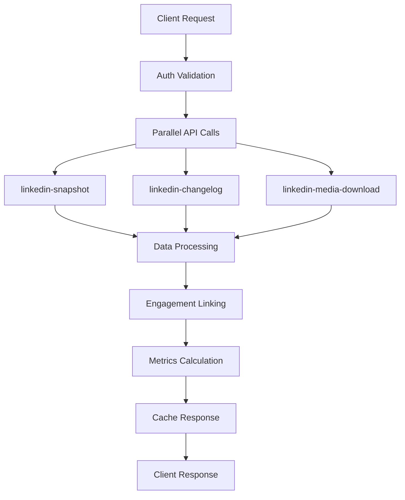

# LinkedIn Growth SaaS - Project Structure Documentation

## 📋 Table of Contents
1. [Project Overview](#project-overview)
2. [Technology Stack](#technology-stack)
3. [Project Architecture](#project-architecture)
4. [Directory Structure](#directory-structure)
5. [Core Components](#core-components)
6. [Module Features](#module-features)
7. [Services & APIs](#services--apis)
8. [State Management](#state-management)
9. [Authentication Flow](#authentication-flow)
10. [Data Processing](#data-processing)
11. [Deployment & Infrastructure](#deployment--infrastructure)

## 🎯 Project Overview

LinkedIn Growth SaaS is a comprehensive platform designed to help professionals grow their LinkedIn presence through advanced analytics, AI-powered content creation, and strategic engagement tools. The application leverages LinkedIn's DMA (Data Member Agreement) APIs to provide real-time insights and actionable recommendations.

### Key Features
- **Real-time LinkedIn Analytics**: Profile views, search appearances, engagement metrics
- **AI-Powered Content Generation**: Smart post creation and rewriting
- **Synergy Partner Management**: Strategic connection building
- **Post Scheduling & Management**: Content calendar and automation
- **Algorithm Insights**: LinkedIn algorithm optimization recommendations
- **Historical Post Analysis**: Performance tracking and repurposing

## 📊 LinkedIn DMA API Implementation

This application implements a comprehensive LinkedIn Data Member Access (DMA) API integration following LinkedIn's official documentation and best practices.

### API Endpoints Implemented

#### Member Snapshot API
```
GET https://api.linkedin.com/rest/memberSnapshotData?q=criteria&domain=<DOMAIN>
```

**Supported Domains:**
- `PROFILE` - Profile completeness and basic information
- `CONNECTIONS` - Network connections and relationship data
- `MEMBER_SHARE_INFO` - Posts and content shares
- `ALL_COMMENTS` - Comments authored by the member
- `ALL_LIKES` - Likes given by the member
- `SKILLS` - Professional skills data
- `POSITIONS` - Work experience history
- `EDUCATION` - Educational background

#### Member Changelog API
```
GET https://api.linkedin.com/rest/memberChangeLogs?q=memberAndApplication&count=<COUNT>
```

**Tracks recent activity (last 28 days):**
- Posts creation (`ugcPosts`)
- Social interactions (`socialActions/likes`, `socialActions/comments`)
- Network invitations (`invitations`)
- Messaging activity (`messages`)

#### Media Download API
```
GET https://api.linkedin.com/rest/mediaDownload?mediaUrn=<MEDIA_URN>
```

**For accessing post images and media assets using digitalmediaAsset URNs**

### Enhanced Implementation Features

#### 🚀 Performance Optimizations
- **Parallel API Calls**: All data sources fetched simultaneously
- **Smart Caching**: 10-15 minute cache for snapshot responses
- **Data Fallback Logic**: Uses snapshot data when changelog is sparse
- **Comprehensive Timing**: Performance monitoring and optimization

#### 🔗 Advanced Data Linking
- **Post-Engagement Mapping**: Links likes/comments to specific posts via `objectUrn`
- **Dual Data Sources**: Combines recent (changelog) and historical (snapshot) data
- **Data Quality Assessment**: Monitors and reports data availability
- **Intelligent Aggregation**: Enhanced metrics calculation with proper data relationships

#### 🛡️ Robust Error Handling
- **Token Expiry Management**: Handles 1-hour DMA token expiration
- **Permission Validation**: Comprehensive scope and access checking
- **Parameter Validation**: Input sanitization and format verification
- **Detailed Error Logging**: Comprehensive debugging and monitoring

#### 📈 Dashboard Metrics (10-Point Scoring System)
1. **Profile Completeness**: Analyzes profile fields, skills, experience
2. **Posting Activity**: 30-day posting frequency with fallback logic
3. **Engagement Quality**: Per-post engagement analysis with proper linking
4. **Network Growth**: New connections and invitation tracking
5. **Audience Relevance**: Industry diversity and professional connection analysis
6. **Content Diversity**: Post type categorization and variety scoring
7. **Engagement Rate**: Network-relative engagement performance
8. **Mutual Interactions**: Reciprocal engagement behavior analysis
9. **Profile Visibility**: Search appearances and profile view metrics
10. **Professional Brand**: Brand consistency and professional signals

### Implementation Architecture



### API Functions

#### Core Functions
- `linkedin-snapshot.js` - Enhanced snapshot data fetching with domain validation
- `linkedin-changelog.js` - Recent activity tracking with comprehensive logging
- `linkedin-media-download.js` - Media asset download with URN validation
- `dashboard-data.js` - Advanced metrics calculation and data processing
- `analytics-data.js` - Detailed analytics and trend analysis

#### Data Processing Pipeline
1. **Authentication**: DMA token validation with scope verification
2. **Parallel Fetching**: Simultaneous API calls for optimal performance
3. **Data Validation**: Comprehensive data quality assessment
4. **Engagement Linking**: URN-based post-engagement relationship mapping
5. **Metrics Calculation**: Advanced scoring algorithms with fallback logic
6. **Response Caching**: Intelligent caching for performance optimization

### Monitoring & Debugging

The implementation includes comprehensive observability:

```javascript
// Example logging output
Dashboard Data: API calls completed in 1247ms
Dashboard Data: API data summary: {
  profile: 1, connections: 847, posts: 23, changelog: 156,
  allComments: 89, allLikes: 234
}
Dashboard Data: Data quality assessment: {
  hasRecentActivity: true, hasEngagementData: true,
  hasProfileData: true, hasNetworkData: true
}
```

### Usage Examples

#### Dashboard Data
```javascript
const response = await fetch('/.netlify/functions/dashboard-data', {
  headers: {
    'Authorization': `Bearer ${dmaToken}`,
    'Content-Type': 'application/json'
  }
});
```

#### Analytics Data
```javascript
const response = await fetch('/.netlify/functions/analytics-data?timeRange=30d', {
  headers: {
    'Authorization': `Bearer ${dmaToken}`,
    'Content-Type': 'application/json'
  }
});
```

#### Media Download
```javascript
const response = await fetch(`/.netlify/functions/linkedin-media-download?mediaUrn=${mediaUrn}`, {
  headers: {
    'Authorization': `Bearer ${dmaToken}`,
    'Content-Type': 'application/json'
  }
});
```

## 🛠 Technology Stack

### Frontend
- **React 18.3.1**: Modern React with hooks and concurrent features
- **TypeScript**: Type-safe development
- **Vite 5.4.2**: Fast build tool and development server
- **Tailwind CSS 3.4.1**: Utility-first CSS framework
- **Framer Motion 12.23.6**: Animation and gesture library
- **React Router DOM 7.7.0**: Client-side routing
- **React Query (@tanstack/react-query 5.83.0)**: Server state management
- **Recharts 3.1.0**: Data visualization library
- **Zustand 5.0.6**: Lightweight state management

### Backend & APIs
- **Netlify Functions**: Serverless backend functions
- **LinkedIn DMA APIs**: Data access and analytics
- **OpenAI API**: AI content generation
- **Stripe API**: Payment processing (future implementation)

### Development Tools
- **ESLint**: Code linting and quality
- **TypeScript ESLint**: TypeScript-specific linting
- **PostCSS & Autoprefixer**: CSS processing
- **Lucide React**: Icon library

## 🏗 Project Architecture :

```
┌─────────────────┐    ┌─────────────────┐    ┌─────────────────┐
│   Frontend      │    │   Netlify       │    │   LinkedIn      │
│   (React/Vite)  │◄──►│   Functions     │◄──►│   DMA APIs      │
│                 │    │   (Serverless)  │    │                 │
└─────────────────┘    └─────────────────┘    └─────────────────┘
         │                       │                       │
         ▼                       ▼                       ▼
┌─────────────────┐    ┌─────────────────┐    ┌─────────────────┐
│   State Mgmt    │    │   OAuth Flow    │    │   Data Storage  │
│   (Zustand)     │    │   (LinkedIn)    │    │   (LocalStorage)│
└─────────────────┘    └─────────────────┘    └─────────────────┘

### Data Flow
1. **Authentication**: OAuth 2.0 flow with LinkedIn (Basic + DMA permissions)
2. **Data Fetching**: Netlify Functions proxy LinkedIn API calls
3. **State Management**: Zustand stores auth state and app configuration
4. **Data Processing**: Custom services process and analyze LinkedIn data
5. **UI Rendering**: React components display processed data with animations

## 📁 Directory Structure

```
linkedin-growth-saas/
├── 📁 public/                          # Static assets
│   ├── vite.svg                        # Vite logo
│   └── favicon.ico                     # Site favicon
│
├── 📁 src/                             # Source code
│   ├── 📁 components/                  # React components
│   │   ├── 📁 auth/                    # Authentication components
│   │   │   └── AuthFlow.tsx            # OAuth flow management
│   │   ├── 📁 dashboard/               # Dashboard components
│   │   │   ├── Dashboard.tsx           # Main dashboard
│   │   │   └── StatsCard.tsx           # Metric display cards
│   │   ├── 📁 landing/                 # Landing page components
│   │   │   └── LandingPage.tsx         # Marketing landing page
│   │   ├── 📁 layout/                  # Layout components
│   │   │   ├── Header.tsx              # App header
│   │   │   ├── Sidebar.tsx             # Navigation sidebar
│   │   │   └── NavItem.tsx             # Navigation items
│   │   ├── 📁 modules/                 # Feature modules
│   │   │   ├── Analytics.tsx           # Analytics dashboard
│   │   │   ├── CreationEngine.tsx      # Content creation tools
│   │   │   ├── DMATestPage.tsx         # API testing interface
│   │   │   ├── PostGen.tsx             # AI post generation
│   │   │   ├── PostPulse.tsx           # Historical post management
│   │   │   ├── Scheduler.tsx           # Content scheduling
│   │   │   ├── Settings.tsx            # User settings
│   │   │   ├── Synergy.tsx             # Partner management
│   │   │   └── TheAlgo.tsx             # Algorithm insights
│   │   └── 📁 ui/                      # Reusable UI components
│   │       ├── Button.tsx              # Button component
│   │       ├── Card.tsx                # Card component
│   │       └── LoadingSpinner.tsx      # Loading indicator
│   │
│   ├── 📁 hooks/                       # Custom React hooks
│   │   └── useLinkedInData.ts          # LinkedIn data fetching hooks
│   │
│   ├── 📁 services/                    # Business logic services
│   │   ├── analytics-processor.ts      # Data analytics processing
│   │   ├── linkedin.ts                 # LinkedIn API client
│   │   ├── linkedin-data-service.ts    # LinkedIn data service
│   │   └── openai.ts                   # OpenAI integration
│   │
│   ├── 📁 stores/                      # State management
│   │   ├── appStore.ts                 # App-wide state
│   │   └── authStore.ts                # Authentication state
│   │
│   ├── 📁 types/                       # TypeScript definitions
│   │   └── linkedin.ts                 # LinkedIn API types
│   │
│   ├── App.tsx                         # Main app component
│   ├── AppContent.tsx                  # App content router
│   ├── main.tsx                        # App entry point
│   ├── index.css                       # Global styles
│   └── vite-env.d.ts                   # Vite type definitions
│
├── 📁 netlify/                         # Netlify configuration
│   └── 📁 functions/                   # Serverless functions
│       ├── linkedin-oauth-start.js     # OAuth initiation
│       ├── linkedin-oauth-callback.js  # OAuth callback handler
│       ├── linkedin-profile.js         # Profile data fetching
│       ├── linkedin-changelog.js       # Activity data fetching
│       ├── linkedin-snapshot.js        # Historical data fetching
│       └── fetch-profile-metrics.js    # Profile metrics extraction
│
├── 📄 Configuration Files
├── .env.example                        # Environment variables template
├── netlify.toml                        # Netlify deployment config
├── package.json                        # Dependencies and scripts
├── tailwind.config.js                  # Tailwind CSS configuration
├── tsconfig.json                       # TypeScript configuration
├── tsconfig.app.json                   # App-specific TypeScript config
├── tsconfig.node.json                  # Node-specific TypeScript config
├── vite.config.ts                      # Vite build configuration
├── postcss.config.js                   # PostCSS configuration
└── eslint.config.js                    # ESLint configuration
```

## 🧩 Core Components

### 1. App.tsx
**Purpose**: Main application component and routing logic
**Features**:
- Authentication state management
- Route protection and redirection
- OAuth callback parameter handling
- Layout rendering based on auth state

```typescript
// Key responsibilities:
- Check authentication status (basic + DMA)
- Handle OAuth callback parameters
- Render appropriate component (Landing/Auth/Dashboard)
- Manage loading states during auth transitions
```

### 2. AppContent.tsx
**Purpose**: Content router for authenticated users
**Features**:
- Module navigation handling
- URL parameter processing
- Dynamic component rendering

### 3. AuthFlow.tsx
**Purpose**: Manages LinkedIn OAuth authentication process
**Features**:
- Two-step OAuth flow (Basic + DMA permissions)
- Visual progress indicators
- Error handling and retry logic
- Automatic redirection after completion

## 🎯 Module Features

### 1. Dashboard (`Dashboard.tsx`)
**Purpose**: Main analytics overview and quick actions
**Features**:
- **Key Metrics Display**: Profile views, connections, engagement, search appearances
- **Time Period Indicators**: "Past Year" labels for all metrics
- **Activity Summary**: 28-day activity breakdown
- **Quick Action Buttons**: Direct navigation to other modules
- **Real-time Data**: Live LinkedIn metrics via DMA APIs

**Implementation**:
```typescript
// Data sources:
- Profile views: PROFILE domain snapshot
- Connections: CONNECTIONS domain snapshot
- Engagement: Calculated from changelog API
- Activity: Recent activity from changelog API
```

### 2. PostPulse (`PostPulse.tsx`)
**Purpose**: Historical post management and repurposing
**Features**:
- **Post Grid Display**: Visual cards with thumbnails
- **Engagement Metrics**: Likes, comments, shares per post
- **Repost Status**: 30-day rule enforcement with visual indicators
- **Content Preview**: Truncated captions with full text on hover
- **One-Click Repurposing**: Direct integration with PostGen
- **Search & Filter**: Find posts by content or engagement level

**Implementation**:
```typescript
// Data processing:
1. Fetch posts from MEMBER_SHARE_INFO snapshot
2. Get engagement from changelog API
3. Calculate repost eligibility (30+ days old)
4. Display with thumbnails and metrics
5. Enable repurposing to PostGen rewrite tab
```

### 3. PostGen (`PostGen.tsx`)
**Purpose**: AI-powered content creation and rewriting
**Features**:
- **Dual Mode Interface**: Create new posts vs. rewrite existing
- **AI Content Generation**: OpenAI integration for smart content
- **Media Upload**: Support for images and videos
- **Scheduling Integration**: Direct connection to scheduler
- **Template Library**: Pre-built content templates
- **Engagement Prediction**: AI-powered performance estimates

**Implementation**:
```typescript
// Content generation flow:
1. User provides topic/existing content
2. OpenAI API generates optimized content
3. User can edit and customize
4. Schedule or publish immediately
5. Track performance post-publication
```

### 4. Analytics (`Analytics.tsx`)
**Purpose**: Comprehensive data visualization and insights
**Features**:
- **Multiple Chart Types**: Line, bar, pie, area charts
- **Time Range Selection**: 7d, 30d, 90d, 365d, custom
- **Engagement Breakdown**: Detailed performance analysis
- **Content Performance**: Best posting times and content types
- **Network Analysis**: Connection demographics and growth
- **Export Capabilities**: Data export for external analysis

**Implementation**:
```typescript
// Visualization components:
- Recharts for interactive charts
- Real-time data processing
- Responsive design for all screen sizes
- Custom color schemes and animations
```

### 5. Synergy (`Synergy.tsx`)
**Purpose**: Strategic partner management and engagement
**Features**:
- **Partner Profiles**: Detailed connection information
- **Engagement Tracking**: Interaction history and frequency
- **AI Comment Suggestions**: Smart engagement recommendations
- **Performance Grading**: A-F rating system for partners
- **Bulk Actions**: Mass engagement and outreach tools
- **Relationship Insights**: Connection strength analysis

### 6. TheAlgo (`TheAlgo.tsx`)
**Purpose**: LinkedIn algorithm insights and optimization
**Features**:
- **Algorithm Performance**: Real-time visibility scoring
- **Posting Optimization**: Best times and content types
- **Engagement Patterns**: Trend analysis and predictions
- **AI Analysis**: OpenAI-powered algorithm insights
- **Recommendation Engine**: Actionable optimization tips
- **Performance Tracking**: Algorithm grade monitoring

### 7. CreationEngine (`CreationEngine.tsx`)
**Purpose**: Advanced content strategy and idea generation
**Features**:
- **Content Strategy Analysis**: Performance-based recommendations
- **Idea Generation**: AI-powered content suggestions
- **Content Mix Analysis**: Optimal content type distribution
- **Posting Frequency**: Data-driven scheduling recommendations
- **Trend Integration**: Industry trend incorporation
- **Performance Prediction**: Engagement forecasting

### 8. Scheduler (`Scheduler.tsx`)
**Purpose**: Content calendar and automated posting
**Features**:
- **Visual Calendar**: Drag-and-drop scheduling interface
- **Bulk Scheduling**: Multiple post management
- **Optimal Timing**: AI-suggested posting times
- **Content Queue**: Automated posting pipeline
- **Performance Tracking**: Scheduled post analytics
- **Template Integration**: Reusable content templates

### 9. Settings (`Settings.tsx`)
**Purpose**: User preferences and account management
**Features**:
- **Profile Management**: LinkedIn profile sync
- **Notification Settings**: Customizable alerts
- **Privacy Controls**: Data access permissions
- **Export Tools**: Data portability options
- **Account Security**: Authentication management
- **Billing Integration**: Subscription management (future)

### 10. DMATestPage (`DMATestPage.tsx`)
**Purpose**: LinkedIn API testing and debugging interface
**Features**:
- **Comprehensive API Testing**: All LinkedIn DMA endpoints
- **Data Exploration**: Raw API response viewing
- **Metric Calculation**: Real-time data processing
- **Debug Tools**: Console output capture
- **Performance Monitoring**: API response time tracking
- **Error Diagnostics**: Detailed error reporting

## 🔧 Services & APIs

### 1. LinkedIn Data Service (`linkedin-data-service.ts`)
**Purpose**: Centralized LinkedIn API interaction
**Features**:
- **Profile Metrics**: Views, search appearances, demographics
- **Engagement Calculation**: Post performance analysis
- **Connection Analysis**: Network growth and composition
- **Activity Tracking**: User behavior monitoring
- **Data Correlation**: Cross-reference different data sources

### 2. Analytics Processor (`analytics-processor.ts`)
**Purpose**: Advanced data processing and metric calculation
**Features**:
- **Comprehensive Metrics**: All-in-one analytics calculation
- **Derived Insights**: Calculated metrics from raw data
- **Performance Trends**: Historical analysis and forecasting
- **Content Analysis**: Post performance categorization
- **Network Insights**: Connection pattern analysis

### 3. OpenAI Service (`openai.ts`)
**Purpose**: AI-powered content generation and analysis
**Features**:
- **Content Generation**: Smart post creation
- **Performance Analysis**: AI-driven insights
- **Strategy Generation**: Personalized content strategies
- **Trend Analysis**: Industry trend integration
- **Optimization Recommendations**: AI-powered suggestions

### 4. LinkedIn API Client (`linkedin.ts`)
**Purpose**: Direct LinkedIn API communication
**Features**:
- **Profile Data**: User profile information
- **Changelog Access**: Recent activity tracking
- **Snapshot Data**: Historical information retrieval
- **OAuth Management**: Authentication flow handling
- **Error Handling**: Robust API error management

## 🗄 State Management

### 1. Auth Store (`authStore.ts`)
**Purpose**: Authentication state management
**State**:
```typescript
interface AuthState {
  accessToken: string | null;        // Basic LinkedIn access
  dmaToken: string | null;           // DMA API access
  profile: LinkedInProfile | null;   // User profile data
  isBasicAuthenticated: boolean;     // Basic auth status
  isFullyAuthenticated: boolean;     // Full auth status
}
```

### 2. App Store (`appStore.ts`)
**Purpose**: Application-wide state management
**State**:
```typescript
interface AppState {
  sidebarCollapsed: boolean;         // Sidebar visibility
  darkMode: boolean;                 // Theme preference (forced light)
  currentModule: string;             // Active module
}
```

## 🔐 Authentication Flow

### Two-Step OAuth Process
1. **Basic Authentication**:
   - Scopes: `openid profile email w_member_social`
   - Purpose: Profile access and basic posting
   - Client ID: `LINKEDIN_CLIENT_ID`

2. **DMA Authentication**:
   - Scopes: `r_dma_portability_3rd_party`
   - Purpose: Advanced analytics and data access
   - Client ID: `LINKEDIN_DMA_CLIENT_ID`

### Flow Diagram
```
User → Landing Page → Basic OAuth → DMA OAuth → Dashboard
  ↓         ↓            ↓            ↓          ↓
Start → Sign In → Profile Access → Data Access → Full Features
```

## 📊 Data Processing

### 1. Profile Metrics Extraction
```typescript
// Data sources and processing:
PROFILE Domain → Profile Views, Search Appearances
CONNECTIONS Domain → Network size, growth, demographics
MEMBER_SHARE_INFO → Historical posts and content
Changelog API → Recent activity and engagement
```

### 2. Engagement Calculation
```typescript
// Process:
1. Identify user's posts from changelog/snapshot
2. Count likes/comments on those posts
3. Calculate totals and averages
4. Generate engagement rates and trends
```

### 3. Content Analysis
```typescript
// Analysis types:
- Content type distribution (text, image, video)
- Posting frequency patterns
- Optimal posting times
- Engagement correlation with content types
- Performance trends over time
```

## 🚀 Deployment & Infrastructure

### Netlify Configuration
- **Build Command**: `npm run build`
- **Publish Directory**: `dist`
- **Functions Directory**: `netlify/functions`
- **Node Version**: 18.x

### Environment Variables
```bash
# LinkedIn OAuth - Basic
LINKEDIN_CLIENT_ID=your_basic_client_id
LINKEDIN_CLIENT_SECRET=your_basic_client_secret

# LinkedIn OAuth - DMA
LINKEDIN_DMA_CLIENT_ID=your_dma_client_id
LINKEDIN_DMA_CLIENT_SECRET=your_dma_client_secret

# AI Services
OPENAI_API_KEY=your_openai_api_key
VITE_OPENAI_API_KEY=your_openai_api_key

# Payment Processing (Future)
STRIPE_SECRET_KEY=your_stripe_secret_key
VITE_STRIPE_PUBLIC_KEY=your_stripe_public_key
```

### Serverless Functions
- **OAuth Handlers**: Authentication flow management
- **API Proxies**: LinkedIn API request proxying
- **Data Processors**: Server-side data processing
- **Webhook Handlers**: External service integrations

## 🔄 Data Flow Architecture

### 1. Authentication Flow
```
User → Netlify Function → LinkedIn OAuth → Callback → Token Storage → App Access
```

### 2. Data Fetching Flow
```
Component → Custom Hook → Service Layer → Netlify Function → LinkedIn API → Data Processing → UI Update
```

### 3. Content Creation Flow
```
User Input → PostGen → OpenAI API → Content Generation → Review/Edit → Schedule/Publish
```

## 🎨 UI/UX Design System

### Design Principles
- **Glass Morphism**: Translucent cards with backdrop blur
- **Gradient Accents**: Blue to cyan color schemes
- **Micro-interactions**: Framer Motion animations
- **Responsive Design**: Mobile-first approach
- **Accessibility**: WCAG 2.1 compliance

### Component Library
- **Cards**: Glass morphism design with hover effects
- **Buttons**: Gradient backgrounds with animations
- **Charts**: Interactive Recharts visualizations
- **Loading States**: Smooth skeleton screens
- **Modals**: Backdrop blur with smooth transitions

## 🧪 Testing & Quality Assurance

### Testing Strategy
- **DMA Test Page**: Comprehensive API testing interface
- **Error Boundaries**: Graceful error handling
- **Loading States**: Proper loading indicators
- **Fallback Data**: Sample data when APIs fail
- **Debug Logging**: Comprehensive console logging

### Code Quality
- **TypeScript**: Full type safety
- **ESLint**: Code quality enforcement
- **Prettier**: Code formatting
- **Component Architecture**: Modular, reusable components
- **Performance Optimization**: React Query caching, lazy loading

## 📈 Performance Optimization

### Frontend Optimization
- **Code Splitting**: Route-based lazy loading
- **Image Optimization**: WebP format, lazy loading
- **Bundle Analysis**: Vite bundle optimization
- **Caching Strategy**: React Query intelligent caching
- **Animation Performance**: Hardware-accelerated animations

### API Optimization
- **Request Batching**: Multiple API calls optimization
- **Caching Layer**: Intelligent data caching
- **Error Retry Logic**: Exponential backoff
- **Rate Limiting**: Respectful API usage
- **Data Transformation**: Efficient data processing

## 🔮 Future Enhancements

### Planned Features
- **Team Collaboration**: Multi-user workspaces
- **Advanced AI**: GPT-4 integration for better content
- **Automation**: Advanced scheduling and auto-posting
- **Integrations**: CRM and marketing tool connections
- **Mobile App**: React Native mobile application
- **Enterprise Features**: Advanced analytics and reporting

### Technical Improvements
- **Database Integration**: Persistent data storage
- **Real-time Updates**: WebSocket connections
- **Advanced Caching**: Redis integration
- **Monitoring**: Application performance monitoring
- **Testing**: Comprehensive test suite
- **Documentation**: API documentation and guides

---

# LinkedIn Growth SaaS - Project Structure Documentation

## 📋 Table of Contents
1. [Project Overview](#project-overview)
2. [Technology Stack](#technology-stack)
3. [Project Architecture](#project-architecture)
4. [Directory Structure](#directory-structure)
5. [Core Components](#core-components)
6. [Module Features](#module-features)
7. [Services & APIs](#services--apis)
8. [State Management](#state-management)
9. [Authentication Flow](#authentication-flow)
10. [Data Processing](#data-processing)
11. [Deployment & Infrastructure](#deployment--infrastructure)

## 🎯 Project Overview

LinkedIn Growth SaaS is a comprehensive platform designed to help professionals grow their LinkedIn presence through advanced analytics, AI-powered content creation, and strategic engagement tools. The application leverages LinkedIn's DMA (Data Member Agreement) APIs to provide real-time insights and actionable recommendations.

### Key Features
- **Real-time LinkedIn Analytics**: Profile views, search appearances, engagement metrics
- **AI-Powered Content Generation**: Smart post creation and rewriting
- **Synergy Partner Management**: Strategic connection building
- **Post Scheduling & Management**: Content calendar and automation
- **Algorithm Insights**: LinkedIn algorithm optimization recommendations
- **Historical Post Analysis**: Performance tracking and repurposing

## 🛠 Technology Stack

### Frontend
- **React 18.3.1**: Modern React with hooks and concurrent features
- **TypeScript**: Type-safe development
- **Vite 5.4.2**: Fast build tool and development server
- **Tailwind CSS 3.4.1**: Utility-first CSS framework
- **Framer Motion 12.23.6**: Animation and gesture library
- **React Router DOM 7.7.0**: Client-side routing
- **React Query (@tanstack/react-query 5.83.0)**: Server state management
- **Recharts 3.1.0**: Data visualization library
- **Zustand 5.0.6**: Lightweight state management

### Backend & APIs
- **Netlify Functions**: Serverless backend functions
- **LinkedIn DMA APIs**: Data access and analytics
- **OpenAI API**: AI content generation
- **Stripe API**: Payment processing (future implementation)

### Development Tools
- **ESLint**: Code linting and quality
- **TypeScript ESLint**: TypeScript-specific linting
- **PostCSS & Autoprefixer**: CSS processing
- **Lucide React**: Icon library

## 🏗 Project Architecture

```
┌─────────────────┐    ┌─────────────────┐    ┌─────────────────┐
│   Frontend      │    │   Netlify       │    │   LinkedIn      │
│   (React/Vite)  │◄──►│   Functions     │◄──►│   DMA APIs      │
│                 │    │   (Serverless)  │    │                 │
└─────────────────┘    └─────────────────┘    └─────────────────┘
         │                       │                       │
         ▼                       ▼                       ▼
┌─────────────────┐    ┌─────────────────┐    ┌─────────────────┐
│   State Mgmt    │    │   OAuth Flow    │    │   Data Storage  │
│   (Zustand)     │    │   (LinkedIn)    │    │   (LocalStorage)│
└─────────────────┘    └─────────────────┘    └─────────────────┘
```

### Data Flow
1. **Authentication**: OAuth 2.0 flow with LinkedIn (Basic + DMA permissions)
2. **Data Fetching**: Netlify Functions proxy LinkedIn API calls
3. **State Management**: Zustand stores auth state and app configuration
4. **Data Processing**: Custom services process and analyze LinkedIn data
5. **UI Rendering**: React components display processed data with animations

## 📁 Directory Structure

```
linkedin-growth-saas/
├── 📁 public/                          # Static assets
│   ├── vite.svg                        # Vite logo
│   └── favicon.ico                     # Site favicon
│
├── 📁 src/                             # Source code
│   ├── 📁 components/                  # React components
│   │   ├── 📁 auth/                    # Authentication components
│   │   │   └── AuthFlow.tsx            # OAuth flow management
│   │   ├── 📁 dashboard/               # Dashboard components
│   │   │   ├── Dashboard.tsx           # Main dashboard
│   │   │   └── StatsCard.tsx           # Metric display cards
│   │   ├── 📁 landing/                 # Landing page components
│   │   │   └── LandingPage.tsx         # Marketing landing page
│   │   ├── 📁 layout/                  # Layout components
│   │   │   ├── Header.tsx              # App header
│   │   │   ├── Sidebar.tsx             # Navigation sidebar
│   │   │   └── NavItem.tsx             # Navigation items
│   │   ├── 📁 modules/                 # Feature modules
│   │   │   ├── Analytics.tsx           # Analytics dashboard
│   │   │   ├── CreationEngine.tsx      # Content creation tools
│   │   │   ├── DMATestPage.tsx         # API testing interface
│   │   │   ├── PostGen.tsx             # AI post generation
│   │   │   ├── PostPulse.tsx           # Historical post management
│   │   │   ├── Scheduler.tsx           # Content scheduling
│   │   │   ├── Settings.tsx            # User settings
│   │   │   ├── Synergy.tsx             # Partner management
│   │   │   └── TheAlgo.tsx             # Algorithm insights
│   │   └── 📁 ui/                      # Reusable UI components
│   │       ├── Button.tsx              # Button component
│   │       ├── Card.tsx                # Card component
│   │       └── LoadingSpinner.tsx      # Loading indicator
│   │
│   ├── 📁 hooks/                       # Custom React hooks
│   │   └── useLinkedInData.ts          # LinkedIn data fetching hooks
│   │
│   ├── 📁 services/                    # Business logic services
│   │   ├── analytics-processor.ts      # Data analytics processing
│   │   ├── linkedin.ts                 # LinkedIn API client
│   │   ├── linkedin-data-service.ts    # LinkedIn data service
│   │   └── openai.ts                   # OpenAI integration
│   │
│   ├── 📁 stores/                      # State management
│   │   ├── appStore.ts                 # App-wide state
│   │   └── authStore.ts                # Authentication state
│   │
│   ├── 📁 types/                       # TypeScript definitions
│   │   └── linkedin.ts                 # LinkedIn API types
│   │
│   ├── App.tsx                         # Main app component
│   ├── AppContent.tsx                  # App content router
│   ├── main.tsx                        # App entry point
│   ├── index.css                       # Global styles
│   └── vite-env.d.ts                   # Vite type definitions
│
├── 📁 netlify/                         # Netlify configuration
│   └── 📁 functions/                   # Serverless functions
│       ├── linkedin-oauth-start.js     # OAuth initiation
│       ├── linkedin-oauth-callback.js  # OAuth callback handler
│       ├── linkedin-profile.js         # Profile data fetching
│       ├── linkedin-changelog.js       # Activity data fetching
│       ├── linkedin-snapshot.js        # Historical data fetching
│       └── fetch-profile-metrics.js    # Profile metrics extraction
│
├── 📄 Configuration Files
├── .env.example                        # Environment variables template
├── netlify.toml                        # Netlify deployment config
├── package.json                        # Dependencies and scripts
├── tailwind.config.js                  # Tailwind CSS configuration
├── tsconfig.json                       # TypeScript configuration
├── tsconfig.app.json                   # App-specific TypeScript config
├── tsconfig.node.json                  # Node-specific TypeScript config
├── vite.config.ts                      # Vite build configuration
├── postcss.config.js                   # PostCSS configuration
└── eslint.config.js                    # ESLint configuration
```

## 🧩 Core Components

### 1. App.tsx
**Purpose**: Main application component and routing logic
**Features**:
- Authentication state management
- Route protection and redirection
- OAuth callback parameter handling
- Layout rendering based on auth state

```typescript
// Key responsibilities:
- Check authentication status (basic + DMA)
- Handle OAuth callback parameters
- Render appropriate component (Landing/Auth/Dashboard)
- Manage loading states during auth transitions
```

### 2. AppContent.tsx
**Purpose**: Content router for authenticated users
**Features**:
- Module navigation handling
- URL parameter processing
- Dynamic component rendering

### 3. AuthFlow.tsx
**Purpose**: Manages LinkedIn OAuth authentication process
**Features**:
- Two-step OAuth flow (Basic + DMA permissions)
- Visual progress indicators
- Error handling and retry logic
- Automatic redirection after completion

## 🎯 Module Features

### 1. Dashboard (`Dashboard.tsx`)
**Purpose**: Main analytics overview and quick actions
**Features**:
- **Key Metrics Display**: Profile views, connections, engagement, search appearances
- **Time Period Indicators**: "Past Year" labels for all metrics
- **Activity Summary**: 28-day activity breakdown
- **Quick Action Buttons**: Direct navigation to other modules
- **Real-time Data**: Live LinkedIn metrics via DMA APIs

**Implementation**:
```typescript
// Data sources:
- Profile views: PROFILE domain snapshot
- Connections: CONNECTIONS domain snapshot
- Engagement: Calculated from changelog API
- Activity: Recent activity from changelog API
```

### 2. PostPulse (`PostPulse.tsx`)
**Purpose**: Historical post management and repurposing
**Features**:
- **Post Grid Display**: Visual cards with thumbnails
- **Engagement Metrics**: Likes, comments, shares per post
- **Repost Status**: 30-day rule enforcement with visual indicators
- **Content Preview**: Truncated captions with full text on hover
- **One-Click Repurposing**: Direct integration with PostGen
- **Search & Filter**: Find posts by content or engagement level

**Implementation**:
```typescript
// Data processing:
1. Fetch posts from MEMBER_SHARE_INFO snapshot
2. Get engagement from changelog API
3. Calculate repost eligibility (30+ days old)
4. Display with thumbnails and metrics
5. Enable repurposing to PostGen rewrite tab
```

### 3. PostGen (`PostGen.tsx`)
**Purpose**: AI-powered content creation and rewriting
**Features**:
- **Dual Mode Interface**: Create new posts vs. rewrite existing
- **AI Content Generation**: OpenAI integration for smart content
- **Media Upload**: Support for images and videos
- **Scheduling Integration**: Direct connection to scheduler
- **Template Library**: Pre-built content templates
- **Engagement Prediction**: AI-powered performance estimates

**Implementation**:
```typescript
// Content generation flow:
1. User provides topic/existing content
2. OpenAI API generates optimized content
3. User can edit and customize
4. Schedule or publish immediately
5. Track performance post-publication
```

### 4. Analytics (`Analytics.tsx`)
**Purpose**: Comprehensive data visualization and insights
**Features**:
- **Multiple Chart Types**: Line, bar, pie, area charts
- **Time Range Selection**: 7d, 30d, 90d, 365d, custom
- **Engagement Breakdown**: Detailed performance analysis
- **Content Performance**: Best posting times and content types
- **Network Analysis**: Connection demographics and growth
- **Export Capabilities**: Data export for external analysis

**Implementation**:
```typescript
// Visualization components:
- Recharts for interactive charts
- Real-time data processing
- Responsive design for all screen sizes
- Custom color schemes and animations
```

### 5. Synergy (`Synergy.tsx`)
**Purpose**: Strategic partner management and engagement
**Features**:
- **Partner Profiles**: Detailed connection information
- **Engagement Tracking**: Interaction history and frequency
- **AI Comment Suggestions**: Smart engagement recommendations
- **Performance Grading**: A-F rating system for partners
- **Bulk Actions**: Mass engagement and outreach tools
- **Relationship Insights**: Connection strength analysis

### 6. TheAlgo (`TheAlgo.tsx`)
**Purpose**: LinkedIn algorithm insights and optimization
**Features**:
- **Algorithm Performance**: Real-time visibility scoring
- **Posting Optimization**: Best times and content types
- **Engagement Patterns**: Trend analysis and predictions
- **AI Analysis**: OpenAI-powered algorithm insights
- **Recommendation Engine**: Actionable optimization tips
- **Performance Tracking**: Algorithm grade monitoring

### 7. CreationEngine (`CreationEngine.tsx`)
**Purpose**: Advanced content strategy and idea generation
**Features**:
- **Content Strategy Analysis**: Performance-based recommendations
- **Idea Generation**: AI-powered content suggestions
- **Content Mix Analysis**: Optimal content type distribution
- **Posting Frequency**: Data-driven scheduling recommendations
- **Trend Integration**: Industry trend incorporation
- **Performance Prediction**: Engagement forecasting

### 8. Scheduler (`Scheduler.tsx`)
**Purpose**: Content calendar and automated posting
**Features**:
- **Visual Calendar**: Drag-and-drop scheduling interface
- **Bulk Scheduling**: Multiple post management
- **Optimal Timing**: AI-suggested posting times
- **Content Queue**: Automated posting pipeline
- **Performance Tracking**: Scheduled post analytics
- **Template Integration**: Reusable content templates

### 9. Settings (`Settings.tsx`)
**Purpose**: User preferences and account management
**Features**:
- **Profile Management**: LinkedIn profile sync
- **Notification Settings**: Customizable alerts
- **Privacy Controls**: Data access permissions
- **Export Tools**: Data portability options
- **Account Security**: Authentication management
- **Billing Integration**: Subscription management (future)

### 10. DMATestPage (`DMATestPage.tsx`)
**Purpose**: LinkedIn API testing and debugging interface
**Features**:
- **Comprehensive API Testing**: All LinkedIn DMA endpoints
- **Data Exploration**: Raw API response viewing
- **Metric Calculation**: Real-time data processing
- **Debug Tools**: Console output capture
- **Performance Monitoring**: API response time tracking
- **Error Diagnostics**: Detailed error reporting

## 🔧 Services & APIs

### 1. LinkedIn Data Service (`linkedin-data-service.ts`)
**Purpose**: Centralized LinkedIn API interaction
**Features**:
- **Profile Metrics**: Views, search appearances, demographics
- **Engagement Calculation**: Post performance analysis
- **Connection Analysis**: Network growth and composition
- **Activity Tracking**: User behavior monitoring
- **Data Correlation**: Cross-reference different data sources

### 2. Analytics Processor (`analytics-processor.ts`)
**Purpose**: Advanced data processing and metric calculation
**Features**:
- **Comprehensive Metrics**: All-in-one analytics calculation
- **Derived Insights**: Calculated metrics from raw data
- **Performance Trends**: Historical analysis and forecasting
- **Content Analysis**: Post performance categorization
- **Network Insights**: Connection pattern analysis

### 3. OpenAI Service (`openai.ts`)
**Purpose**: AI-powered content generation and analysis
**Features**:
- **Content Generation**: Smart post creation
- **Performance Analysis**: AI-driven insights
- **Strategy Generation**: Personalized content strategies
- **Trend Analysis**: Industry trend integration
- **Optimization Recommendations**: AI-powered suggestions

### 4. LinkedIn API Client (`linkedin.ts`)
**Purpose**: Direct LinkedIn API communication
**Features**:
- **Profile Data**: User profile information
- **Changelog Access**: Recent activity tracking
- **Snapshot Data**: Historical information retrieval
- **OAuth Management**: Authentication flow handling
- **Error Handling**: Robust API error management

## 🗄 State Management

### 1. Auth Store (`authStore.ts`)
**Purpose**: Authentication state management
**State**:
```typescript
interface AuthState {
  accessToken: string | null;        // Basic LinkedIn access
  dmaToken: string | null;           // DMA API access
  profile: LinkedInProfile | null;   // User profile data
  isBasicAuthenticated: boolean;     // Basic auth status
  isFullyAuthenticated: boolean;     // Full auth status
}
```

### 2. App Store (`appStore.ts`)
**Purpose**: Application-wide state management
**State**:
```typescript
interface AppState {
  sidebarCollapsed: boolean;         // Sidebar visibility
  darkMode: boolean;                 // Theme preference (forced light)
  currentModule: string;             // Active module
}
```

## 🔐 Authentication Flow

### Two-Step OAuth Process
1. **Basic Authentication**:
   - Scopes: `openid profile email w_member_social`
   - Purpose: Profile access and basic posting
   - Client ID: `LINKEDIN_CLIENT_ID`

2. **DMA Authentication**:
   - Scopes: `r_dma_portability_3rd_party`
   - Purpose: Advanced analytics and data access
   - Client ID: `LINKEDIN_DMA_CLIENT_ID`

### Flow Diagram
```
User → Landing Page → Basic OAuth → DMA OAuth → Dashboard
  ↓         ↓            ↓            ↓          ↓
Start → Sign In → Profile Access → Data Access → Full Features
```

## 📊 Data Processing

### 1. Profile Metrics Extraction
```typescript
// Data sources and processing:
PROFILE Domain → Profile Views, Search Appearances
CONNECTIONS Domain → Network size, growth, demographics
MEMBER_SHARE_INFO → Historical posts and content
Changelog API → Recent activity and engagement
```

### 2. Engagement Calculation
```typescript
// Process:
1. Identify user's posts from changelog/snapshot
2. Count likes/comments on those posts
3. Calculate totals and averages
4. Generate engagement rates and trends
```

### 3. Content Analysis
```typescript
// Analysis types:
- Content type distribution (text, image, video)
- Posting frequency patterns
- Optimal posting times
- Engagement correlation with content types
- Performance trends over time
```

## 🚀 Deployment & Infrastructure

### Netlify Configuration
- **Build Command**: `npm run build`
- **Publish Directory**: `dist`
- **Functions Directory**: `netlify/functions`
- **Node Version**: 18.x

### Environment Variables
```bash
# LinkedIn OAuth - Basic
LINKEDIN_CLIENT_ID=your_basic_client_id
LINKEDIN_CLIENT_SECRET=your_basic_client_secret

# LinkedIn OAuth - DMA
LINKEDIN_DMA_CLIENT_ID=your_dma_client_id
LINKEDIN_DMA_CLIENT_SECRET=your_dma_client_secret

# AI Services
OPENAI_API_KEY=your_openai_api_key
VITE_OPENAI_API_KEY=your_openai_api_key

# Payment Processing (Future)
STRIPE_SECRET_KEY=your_stripe_secret_key
VITE_STRIPE_PUBLIC_KEY=your_stripe_public_key
```

### Serverless Functions
- **OAuth Handlers**: Authentication flow management
- **API Proxies**: LinkedIn API request proxying
- **Data Processors**: Server-side data processing
- **Webhook Handlers**: External service integrations

## 🔄 Data Flow Architecture

### 1. Authentication Flow
```
User → Netlify Function → LinkedIn OAuth → Callback → Token Storage → App Access
```

### 2. Data Fetching Flow
```
Component → Custom Hook → Service Layer → Netlify Function → LinkedIn API → Data Processing → UI Update
```

### 3. Content Creation Flow
```
User Input → PostGen → OpenAI API → Content Generation → Review/Edit → Schedule/Publish
```

## 🎨 UI/UX Design System

### Design Principles
- **Glass Morphism**: Translucent cards with backdrop blur
- **Gradient Accents**: Blue to cyan color schemes
- **Micro-interactions**: Framer Motion animations
- **Responsive Design**: Mobile-first approach
- **Accessibility**: WCAG 2.1 compliance

### Component Library
- **Cards**: Glass morphism design with hover effects
- **Buttons**: Gradient backgrounds with animations
- **Charts**: Interactive Recharts visualizations
- **Loading States**: Smooth skeleton screens
- **Modals**: Backdrop blur with smooth transitions

## 🧪 Testing & Quality Assurance

### Testing Strategy
- **DMA Test Page**: Comprehensive API testing interface
- **Error Boundaries**: Graceful error handling
- **Loading States**: Proper loading indicators
- **Fallback Data**: Sample data when APIs fail
- **Debug Logging**: Comprehensive console logging

### Code Quality
- **TypeScript**: Full type safety
- **ESLint**: Code quality enforcement
- **Prettier**: Code formatting
- **Component Architecture**: Modular, reusable components
- **Performance Optimization**: React Query caching, lazy loading

## 📈 Performance Optimization

### Frontend Optimization
- **Code Splitting**: Route-based lazy loading
- **Image Optimization**: WebP format, lazy loading
- **Bundle Analysis**: Vite bundle optimization
- **Caching Strategy**: React Query intelligent caching
- **Animation Performance**: Hardware-accelerated animations

### API Optimization
- **Request Batching**: Multiple API calls optimization
- **Caching Layer**: Intelligent data caching
- **Error Retry Logic**: Exponential backoff
- **Rate Limiting**: Respectful API usage
- **Data Transformation**: Efficient data processing

## 🔮 Future Enhancements

### Planned Features
- **Team Collaboration**: Multi-user workspaces
- **Advanced AI**: GPT-4 integration for better content
- **Automation**: Advanced scheduling and auto-posting
- **Integrations**: CRM and marketing tool connections
- **Mobile App**: React Native mobile application
- **Enterprise Features**: Advanced analytics and reporting

### Technical Improvements
- **Database Integration**: Persistent data storage
- **Real-time Updates**: WebSocket connections
- **Advanced Caching**: Redis integration
- **Monitoring**: Application performance monitoring
- **Testing**: Comprehensive test suite
- **Documentation**: API documentation and guides

---
# LinkedIn DMA Member Data Portability API Documentation

## Member Data Portability APIs

LinkedIn provides the following Member Data Portability APIs that allow LinkedIn members to download their LinkedIn data or share their LinkedIn data with 3rd Party Applications via APIs.

### Member Data Portability API (3rd Party)
- **GET STARTED**
- Overview
- Member Changelog API
- Member Snapshot API

### Member Data Portability API (Member)
- **GET STARTED**
- Overview
- Member Changelog API
- Member Snapshot API

### General API Topics
- **TRAINING**
- Authentication
- API Concepts
- Breaking Change Policy
- Best Practices

---

## Member Data Portability (3rd Party)

**Date:** 02/05/2024

LinkedIn is providing the Member Data Portability (3rd Party) API product for third party developers in response to certain requirements of the Digital Markets Act (DMA). The DMA is a new EU competition law that regulates large online platforms to ensure fair competition, protect consumer rights, and foster innovation in the digital economy. Consistent with DMA obligations regarding end user data access and portability, the Member Data Portability (3rd Party) product provides APIs that allow third party developer 3rd Party applications to fetch a LinkedIn member's LinkedIn data with their consent.

Querying member data using the Member Data Portability APIs requires access to the Member Data Portability (3rd Party) API product access to which can be requested from our developer portal.

### Getting Started

#### Request Access

1. **Create a Developer Application**
   Create an app on the LinkedIn Developers Platform. A LinkedIn Company Page is required to create the app. You can create a new LinkedIn Page or use your company's existing LinkedIn Page.

2. **Verify LinkedIn Company Page association**
   To request access, the LinkedIn company page association has to be verified by the super admin of company page used while creating the application in step 1. Refer this help article on how to verify the LinkedIn company page association.

3. **Request access to API product**
   From the Products tab of your application, click Request access for Member Data Portability API (3rd Party). Fill in the access request form. Once the responses are reviewed by LinkedIn, access would be granted. To know more about developer application review status refer this LinkedIn help article.

   **Business Verification** - As part of the access request form, you must provide your business email address and organization's legal name, registered address, website, and privacy policy. Your business email address will have to be verified. If you don't receive the verification email, be sure to check your email's spam folder, junk folder, social tab, and promotional tab. Personal email addresses will not pass the business verification process.

4. **Access Grant**
   Once the responses are reviewed and approved and business verified, access would be granted. To know more about developer application review status refer to this LinkedIn help article.

> **Note:** The button to request access would only be enabled if the LinkedIn Company page association has been verified.

#### Getting member consent and access token

Generate access token via Authorization Code flow to make authenticated API calls. Refer Authorization Code Flow (3-legged OAuth) documentation to know more. Make sure you provide the following scope while generating the access token.

| Permission | Description |
|------------|-------------|
| r_dma_portability_3rd_party | Provides access to LinkedIn member data to developers upon member authorization |

Ready to start development? Refer to the links below for guidance on building your application.

- Authentication
- API Concepts
- Breaking Change Policy
- Best Practices
- Error Handling

> **Note:** Only LinkedIn users from the European Economic Area are allowed to consent to share their LinkedIn data with 3rd party developer applications.

### New Development

#### Member Changelog API

Once the member has consented to share data with a 3rd party application, LinkedIn will start archiving all the member's interactions (posts created, comments, reactions etc), from the time the user has consented, on LinkedIn as changelog events. Member Changelog API allows developers to query these changelog events. Developers can only query changelog events created in the past 28 days. To know more about the API and it's usage, refer the Member Changelog API Documentation.

#### Member Snapshot API

Once the member has consented to share data with a 3rd party application, LinkedIn will start archiving all the member data (Account History, Articles, Posts). Member Snapshot API allows developers to fetch the data pertaining to LinkedIn member(s) at a point in time when an API call is made. The API will return data related to specific domains. To know more about the API and its usage, refer to the Member Snapshot API Documentation.

---

## Member Changelog API

**Date:** 11/22/2024

Once the member has consented to share data and an access token is generated, LinkedIn will start archiving all the member's interactions (posts created, comments, reactions etc) on LinkedIn, from the time they consented, as changelog events. Member Changelog API allows you to query and fetch all changelog events archived for a user from the past 28 days.

### Usage

You must use an access token to make an authenticated call on behalf of a user.

### Permissions

| Permission | Description |
|------------|-------------|
| r_dma_portability_3rd_party | Provides access to LinkedIn member data to developers upon member authorization |
| r_dma_portability_member | Allows users to download their own LinkedIn data |

> **Note:** Member Changelog API uses Versioned LinkedIn APIs. Please append the header `LinkedIn-Version: 202312` while making the API requests.

### Member Changelog Events

The following request can be used to query changelog events for a user:

```http
GET https://api.linkedin.com/rest/memberChangeLogs?q=memberAndApplication
```

#### Query Parameters

| Field Name | Required | Description |
|------------|----------|-------------|
| startTime | No | Represented as an inclusive timestamp in epoch milliseconds. If present, returns all the changelog events that are created after the time. |

We currently return events up to 28 days. If you specify a `startTime` older than 28 days of the current timestamp, it will return events up to 28 days. If you specify an invalid timestamp, it will throw a 400 error.

In addition, we recommend querying at a `count=10` to reduce latency and to query each member's activities once an hour. The upper limit is `50`. If you set a number not in the range `[1,50]`, it will result in a `400` and an error message containing the recommended `count`.

If you decide to increase number of activities returned via `count`, keep in mind it will slow down processing time and can lead to timeouts. For querying each member's activities, we recommend spreading out your requests over the hour such that your application is not having QPS spikes, which could lead to timeouts as well.

We also recommend using the capturedAt time returned by Member Changelog API to determine the time of the event activity. There might be instances within the specific activity that do not return the created/lastModified time.

> **Note:** We recommend you specifying `startTime` by using the latest `processedAt` from the previous response. If there is no event from the previous response, keep the same `startTime` for the next request. If there is an event from the response, the next request should use the latest timestamp of the `processedAt` and that event will show up on the next request's response. This way, we will ensure no data loss in the next API request.

### Member Changelog Events Schema

The Member Changelog API will return an array of elements. Each element is an activity record with the following schema:

| Field Name | Description |
|------------|-------------|
| id | The unique identifier for the activity event. |
| capturedAt | Time the event is captured. |
| processedAt | Time the event is processed. |
| configVersion | The configuration version used to process this event. This is unique to the activity's resourceName and method. It can change periodically as we update our configurations to better the API experience. It will mainly used for debugging purpose. |
| owner | The member who owns the record. It is the same member who has retrieval and viewing access to this activity. |
| actor | The member who performs the action of the activity. |
| resourceName | Name of resource being acted upon. |
| resourceId | The identifier of the resource. |
| resourceUri | URI of the resource being modified. Used for remediation. |
| method | The resource method. Can be one of the following methods: CREATE, UPDATE, PARTIAL_UPDATE, DELETE *As of now, if a method is DELETE, the activity and processedActivity fields should be empty since we cannot capture the object after it has been deleted. |
| methodName | The optional string representing the method's name. Only present in ACTION method. |
| activity | The original activity data. Used for remediation. |
| processedActivity | The decorated original activity containing relevant contextual information. For example, if the original activity is a comment, this will include the original share content. Used for archiving. |
| siblingActivities | The activities on the same resource level. This is used for previous sibling comments on a share or previous messages in a conversation. Will return up to 10 most recent previous activities. |
| parentSiblingActivities | The previous activities on the parent resource level. Example would be the previous sibling comments of a parent comment of a nested comment. Will return up to 10 most recent previous activities. |
| activityId | A unique string identifier of a captured activity. If an activity is processed more than once, all generated records share same activityId. |
| activityStatus | NEW! The status of the event. Can be one of the following: SUCCESS - Event is successfully processed on the initial attempt. FAILURE - Event has partial or complete processing failure on the initial attempt. The API will not surface multiple FAILURE events of the same activity. SUCCESSFUL_REPLAY - Event is successfully reprocessed after one or many attempts. |

### Sample Get Response

```json
{
  "owner": "urn:li:person:2qXA98-mVk",
  "resourceId": "0-UzY2MDM3MjAzODc4OTk1OTI3MDRfNTAw",
  "configVersion": 1,
  "method": "CREATE",
  "activity": {
    "owner": "urn:li:person:kAq_1ptj-v",
    "createdAt": 1574449632116,
    "clientExperience": {
      "clientGeneratedToken": "11daeca1-34af-47c2-b22e-d02a947c33a2"
    },
    "author": "urn:li:person:kAq_1ptj-v",
    "id": "0-UzY2MDM3MjAzODc4OTk1OTI3MDRfNTAw",
    "thread": "urn:li:messagingThread:0-NjU5OTczMDkxNTAzODAyNzc3Ng==",
    "readAt": 1574449632000,
    "content": {
      "format": "TEXT",
      "fallback": "Hello back to Sales Navigator inbox",
      "formatVersion": 1,
      "content": {
        "string": "Hello back to Sales Navigator inbox"
      }
    },
    "deliveredAt": 1574449632116
  },
  "resourceName": "messages",
  "resourceUri": "/messages/0-UzY2MDM3MjAzODc4OTk1OTI3MDRfNTAw",
  "actor": "urn:li:person:kAq_1ptj-v",
  "activityId": "c86c3c71-7844-4ed1-b1fc-66deeac14192",
  "processedAt": 1574449662997,
  "capturedAt": 1574449632331,
  "processedActivity": {
    "owner": "urn:li:person:kAq_1ptj-v",
    "owner~": {...},
    "createdAt": 1574449632116,
    "deliveredAt": 1574449632116,
    "author~": {...},
    "thread~": {
      "owner": "urn:li:salesIdentity:334326",
      "membership": [
        {
          "createdAt": 1573498467712,
          "identity~": {
            "member": "urn:li:person:2qXA98-mVk",
            "member~": {...},
            "id": 334326
          },
          "identity": "urn:li:salesIdentity:334326"
        },
        {
          "createdAt": 1573498467712,
          "identity~": {...},
          "identity": "urn:li:person:kAq_1ptj-v"
        }
      ]
    },
    "author": "urn:li:person:kAq_1ptj-v",
    "thread": "urn:li:messagingThread:0-NjU5OTczMDkxNTAzODAyNzc3Ng==",
    "id": "0-UzY2MDM3MjAzODc4OTk1OTI3MDRfNTAw",
    "readAt": 1574449632000,
    "content": {
      "format": "TEXT",
      "fallback": "Hello back to Sales Navigator inbox",
      "formatVersion": 1,
      "content": {
        "string": "Hello back to Sales Navigator inbox"
      }
    }
  },
  "id": 978988628
}
```

---

## Organizations

**Date:** 03/05/2024

The identity of the resourceName is `organizations` and `organizationAcls`. Events relating to creation and updation of company pages have resourceName `organization`. Events relating to adding or removing admins for a company page have resourceName `organizationAcls`.

### Organizations Activity - Creating a Company Page

```json
{
  "owner": "urn:li:person:<personID>",
  "resourceId": "82318779",
  "activity": {
    "vanityName": "test-company-Changelog",
    "created": {
      "actor": "urn:li:person:<personID>",
  "activityId": "4315b496-d754-4fdc-93db-5c20c84a16fa",
  "processedAt": 1657611275478,
  "activityStatus": "SUCCESS",
  "capturedAt": 1657611245380,
  "siblingActivities": [],
  "id": 3331301460
}
```

Adding a member as a `Content Administrator` for a company page.

### OrganizationsAcls Activity - Adding a new admin

```json
{
  "owner": "urn:li:person:<personID>",
  "resourceId": "organization=urn%3Ali%3Aorganization%3A82318779&role=CONTENT_ADMINISTRATOR&roleAssignee=urn:li:person:<personID>",
  "activity": {
    "roleAssignee": "urn:li:person:<personID>",
    "role": "CONTENT_ADMINISTRATOR",
    "state": "APPROVED",
    "organization": "urn:li:organization:82318779"
  },
  "method": "UPDATE",
  "configVersion": 1,
  "parentSiblingActivities": [],
  "resourceName": "organizationAcls",
  "resourceUri": "/organizationAcls/(organization:urn:li:organization:82318779,role:CONTENT_ADMINISTRATOR,roleAssignee:urn:li:person:<personID>)",
  "actor": "urn:li:person:<personID>",
  "activityId": "d837483e-a63d-43e4-a745-8092631a5d60",
  "processedAt": 1657611164764,
  "activityStatus": "SUCCESS",
  "capturedAt": 1657611134668,
  "siblingActivities": [],
  "id": 3331301452
}
```

---

## Invitations

**Date:** 03/05/2024

The identity of the resourceName is `invitations`. Currently, this resource captures all invitations acted on the behalf of the regulated members. This means an invitation sent by the regulated member will show up whereas an invitation received by the regulated member will not show up unless the member accept/decline the invitation. The methods available are `ACTION verifyAndCreate` for invitations created or received, `PARTIAL_UPDATE`, `ACTION inviteeClosingInvitation`, `ACTION inviterClosingInvitation`, `ACTION purge`, and `DELETE`.

Refer here for more information on invitations.

> **Note:** We do not currently capture address/contact book import.

### Action verifyAndCreate - Send an Invitation

```json
{
  "owner": "urn:li:person:<inviterID>",
  "resourceId": "7030825461085577216",
  "activity": {
    "invitationV2": {
      "inviter": "urn:li:person:<inviterID>",
      "invitee": "urn:li:person:<inviteeID>",
      "trackingId": "<>"
    }
  },
  "method": "ACTION",
  "configVersion": 7,
  "parentSiblingActivities": [],
  "methodName": "verifyAndCreate",
  "resourceName": "invitations",
  "resourceUri": "/invitations",
  "actor": "urn:li:person:<inviterID>",
  "activityId": "90431a9a-2897-49cc-b0a0-b9a0292dbc04",
  "processedAt": 1676279446917,
  "activityStatus": "SUCCESS",
  "capturedAt": 1676279416795,
  "siblingActivities": [],
  "id": 1757310665
}
```

### Action inviterClosingInvitation - withdraw an invitation

```json
{
  "activity": {
    "inviteActionData": [
      {
        "invitationId": "urn:li:invitation:6230172048157614080"
      }
    ],
    "inviter": "urn:li:person:Ylpq-RobP9",
    "inviterActionType": "WITHDRAW"
  },
  "activityId": "f8b05048-66e4-46bc-8653-f9fe6f9f3719",
  "actor": "urn:li:person:Ylpq-RobP9",
  "capturedAt": 1496417998332,
  "configVersion": 5,
  "id": 51411,
  "method": "ACTION",
  "methodName": "inviterClosingInvitation",
  "owner": "urn:li:person:Ylpq-RobP9",
  "processedAt": 1496418019786,
  "resourceId": "",
  "resourceName": "invitations",
  "resourceUri": "/invitations"
}
```

---

## Messages

**Date:** 03/05/2024

The identity of the `resourceName` is `messages`. This captures all inbound and outbound messages for direct connection, InMail, Recruiter and Sales Navigator of the members. The method available is `CREATE`.

You can determine whether a Messages event is an inbound or outbound message based on the `actor` field of each event. If the event is an outbound one (e.g. member sends a message), the `actor` field will correspond to the member's `personUrn` and equal to the value of the `owner` field. If the event is inbound, then the field will be of another member's `personUrn`.

All message events' `activity` fields will contain `owner`, `author`, and `thread` fields. These fields will help you figure out the identities of the mailbox and more. The `owner` and `author` field will correspond to the sender's mailbox, which can be personal, Recruiter, or Sales Navigator. The `thread` field contains the `membership` array field that have the `identity` of all the participants in the message thread. For more information on the schema, please refer here.

Below are response examples of inbound and outbound Message events:
- Outbound message with attachment from personal mailbox
- Outbound message from Sales Navigator mailbox
- Inbound message to personal mailbox
- Inbound message to Sales Navigator mailbox
- Outbound GIF message from Recruiter mailbox
- Changelog Event when a member edits a sent message
- Changelog Event when a member deletes a sent message
- Sample response of outbound audio message from personal mailbox
- Sample response of outbound video message from personal mailbox
- Sample response of outbound message with member mention sent from personal mailbox

### Contextual Decoration of entities shared on messages

### Sample response of outbound message activity with attachment from personal mailbox

```json
{
  "owner": "urn:li:person:2qXA98-mVk",
  "resourceId": "0-UzY2MDM0NDMwMzU5NDA0OTUzNjFfNTAw",
  "configVersion": 1,
  "method": "CREATE",
  "activity": {
    "owner": "urn:li:person:2qXA98-mVk",
    "createdAt": 1574383506267,
    "author": "urn:li:person:2qXA98-mVk",
    "id": "0-UzY2MDM0NDMwMzU5NDA0OTUzNjFfNTAw",
    "thread": "urn:li:messagingThread:0-NjU5OTczMTMyOTE1ODQzODkxMg==",
    "readAt": 1574383506000,
    "content": {
      "format": "TEXT",
      "fallback": "Hello from personal message",
      "formatVersion": 1,
      "content": {
        "string": "Hello from personal message"
      },
      "attachments": [
        "urn:li:digitalmediaAsset:C5606AQF245TuEXNVXA"
      ]
    },
    "deliveredAt": 1574383506267
  },
  "resourceName": "messages",
  "resourceUri": "/messages/0-UzY2MDM0NDMwMzU5NDA0OTUzNjFfNTAw",
  "actor": "urn:li:person:2qXA98-mVk",
  "activityId": "b000859e-1239-4d77-b3d3-b8c27ee13409",
  "processedAt": 1574383536887,
  "capturedAt": 1574383506487,
  "thread": "urn:li:messagingThread:0-NjU5OTczMTMyOTE1ODQzODkxMg==",
  "id": "0-UzY2MDM0NDMwMzU5NDA0OTUzNjFfNTAw",
  "readAt": 1574383506000,
  "content": {
    "format": "TEXT",
    "fallback": "Hello from personal message",
    "formatVersion": 1,
    "content": {
      "string": "Hello from personal message"
    }
  },
  "id": 977493340
}
```

### Sample request of media download

```http
GET https://api.linkedin.com/mediaDownload/C4E06AQGlz2sDB72DQw/messaging-attachmentFile/0?app=4355721&m=AQL6O71XM7RYCwAAAWcuIskYd_5WgTBEDPP1vu9mgwr17pkmTwAJepazDA&e=1543963290&v=beta&t=12345
Authorization: Bearer <redacted access token>
```

### Sample response of outbound message activity from Sales Navigator mailbox

```json
{
  "owner": "urn:li:person:2qXA98-mVk",
  "resourceId": "0-UzY2MDM0NDI5OTQyNjU4MTI5OTJfMTAwMA==",
  "configVersion": 1,
  "method": "CREATE",
  "activity": {
    "owner": "urn:li:person:2qXA98-mVk",
    "createdAt": 1574383495992,
    "attachments": [],
    "author": "urn:li:salesIdentity:334326",
    "id": "0-UzY2MDM0NDI5OTQyNjU4MTI5OTJfMTAwMA==",
    "thread": "urn:li:messagingThread:0-NjU5OTczMDkxNTAzODAyNzc3Ng==",
    "readAt": 1574383496000,
    "content": {
      "format": "TEXT",
      "fallback": "Hello from Sales Navigator",
      "formatVersion": 1,
      "content": {
        "string": "Hello from Sales Navigator"
      }
    },
    "deliveredAt": 1574383495992
  },
  "resourceName": "messages",
  "resourceUri": "/messages/0-UzY2MDM0NDI5OTQyNjU4MTI5OTJfMTAwMA==",
  "actor": "urn:li:person:2qXA98-mVk",
  "activityId": "6d43fcff-b56e-4e0f-993b-5a398c89fb5d",
  "processedAt": 1574383527451,
  "capturedAt": 1574383496347,
  "id": 977493324
}
```

### Sample response of inbound message activity to personal mailbox

```json
{
  "owner": "urn:li:person:2qXA98-mVk",
  "resourceId": "0-UzY2MDM0NDgxMzA5MzM1MzA2MjRfNTAw",
  "configVersion": 1,
  "method": "CREATE",
  "activity": {
    "owner": "urn:li:person:kAq_1ptj-v",
    "createdAt": 1574384720910,
    "clientExperience": {
      "clientGeneratedToken": "41453ff9-a796-4259-8b80-e4a5da9f8230"
    },
    "author": "urn:li:person:kAq_1ptj-v",
    "id": "0-UzY2MDM0NDgxMzA5MzM1MzA2MjRfNTAw",
    "thread": "urn:li:messagingThread:0-NjU5OTczMTMyOTE1ODQzODkxMg==",
    "readAt": 1574384721000,
    "content": {
      "format": "TEXT",
      "fallback": "Hello back to personal inbox",
      "formatVersion": 1,
      "content": {
        "string": "Hello back to personal inbox"
      }
    },
    "deliveredAt": 1574384720910
  },
  "resourceName": "messages",
  "resourceUri": "/messages/0-UzY2MDM0NDgxMzA5MzM1MzA2MjRfNTAw",
  "actor": "urn:li:person:kAq_1ptj-v",
  "activityId": "1f9e70cc-925f-4738-a336-718832c9db46",
  "processedAt": 1574384751790,
  "capturedAt": 1574384721128,
  "id": 977493572
}
```

When a member edits a sent message:
- The value of `method` field would be `UPDATE`.
- The `activity` contains the edited content of the message.
- The `resourceId` would be same as the original message sent / received by the member.

### Changelog Event when a member edits a sent message

```json
{
  "owner": "urn:li:person:demo-123",
  "resourceId": "2-demoResourceId123==",
  "activity": {
    "createdAt": 1686212246941,
    "attachments": [],
    "author": "urn:li:person:demo-123",
    "thread": "urn:li:messagingThread:2-demoResourceId123==",
    "content": {
      "format": "TEXT",
      "fallback": "This Sent message has been edited",
      "formatVersion": 1
    }
  },
  "method": "UPDATE",
  "configVersion": 4,
  "parentSiblingActivities": [],
  "resourceName": "messages",
  "resourceUri": "/messages/2-demoResourceId123==",
  "actor": "urn:li:person:demo-123",
  "activityId": "bf2c8e04-99fe-4c9c-be16-4b000b9fd387",
  "processedAt": 1686212247420,
  "activityStatus": "SUCCESS",
  "capturedAt": 1686212247039,
  "siblingActivities": [],
  "id": 1823218385
}
```

When a member deletes a sent message:
- The value of `method` field would be `DELETE`.
- The `activity.content` fields would not be present.
- The `resourceId` would be same as the original message sent / received by the member.

### Changelog Event when a member deletes a sent message

```json
{
  "owner": "urn:li:person:demo-user1",
  "resourceId": "2-demoResourceID==",
  "activity": {
    "createdAt": 1686213029706,
    "attachments": [],
    "author": "urn:li:person:demo-user1",
    "thread": "urn:li:messagingThread:2-demoThreadId=="
  },
  "method": "DELETE",
  "configVersion": 4,
  "parentSiblingActivities": [],
  "resourceName": "messages",
  "resourceUri": "/messages/2-demoResourceID==",
  "actor": "urn:li:person:demo-user1",
  "activityId": "194b0d56-5b05-487f-8b84-da6cbe9e5c31",
  "processedAt": 1686213030032,
  "activityStatus": "SUCCESS",
  "capturedAt": 1686213029729,
  "siblingActivities": [],
  "id": 1823218409
}
```

### Sample response of inbound message activity to Sales Navigator mailbox

```json
{
  "owner": "urn:li:person:2qXA98-mVk",
  "resourceId": "0-UzY2MDM3MjAzODc4OTk1OTI3MDRfNTAw",
  "configVersion": 1,
  "method": "CREATE",
  "activity": {
    "owner": "urn:li:person:kAq_1ptj-v",
    "createdAt": 1574449632116,
    "clientExperience": {
      "clientGeneratedToken": "11daeca1-34af-47c2-b22e-d02a947c33a2"
    },
    "author": "urn:li:person:kAq_1ptj-v",
    "id": "0-UzY2MDM3MjAzODc4OTk1OTI3MDRfNTAw",
    "thread": "urn:li:messagingThread:0-NjU5OTczMDkxNTAzODAyNzc3Ng==",
    "readAt": 1574449632000,
    "content": {
      "format": "TEXT",
      "fallback": "Hello back to Sales Navigator inbox",
      "formatVersion": 1,
      "content": {
        "string": "Hello back to Sales Navigator inbox"
      }
    },
    "deliveredAt": 1574449632116
  },
  "resourceName": "messages",
  "resourceUri": "/messages/0-UzY2MDM3MjAzODc4OTk1OTI3MDRfNTAw",
  "actor": "urn:li:person:kAq_1ptj-v",
  "activityId": "c86c3c71-7844-4ed1-b1fc-66deeac14192",
  "processedAt": 1574449662997,
  "capturedAt": 1574449632331,
  "id": 978988628
}
```

### Sample response of outbound GIF message activity from Recruiter mailbox

```json
{
  "owner": "urn:li:person:2qXA98-mVk",
  "resourceId": "0-UzY123456789",
  "configVersion": 1,
  "method": "CREATE",
  "activity": {
    "owner": "urn:li:person:2qXA98-mVk",
    "createdAt": 1580345063392,
    "attachments": [],
    "author": "urn:li:hireMailbox:00000123456789",
    "id": "0-UzY123456789",
    "thread": "urn:li:messagingThread:0-NjA123456789",
    "readAt": 1580345063000,
    "content": {
      "format": "TEXT",
      "fallback": "",
      "formatVersion": 1,
      "content": {
        "string": ""
      }
    },
    "deliveredAt": 1580345063392,
    "extensionContent": {
      "contentRecordMap": {
        "ThirdPartyMedia": {
          "contentRecord": {
            "com.linkedin.messaging.plugin.content.ThirdPartyMedia": {
              "id": "16144203",
              "media": {
                "gif": {
                  "width": 498,
                  "url": "https://snap.licdn.com/tr/images/09db7a56a494eab4477cfc43ce8ae4db/tenor.gif",
                  "height": 373
                },
                "nanogif": {
                  "width": 120,
                  "url": "https://snap.licdn.com/tr/images/70076b56d82a7cf30d364513ea732998/tenor.gif",
                  "height": 90
                },
                "previewgif": {
                  "width": 220,
                  "url": "https://snap.licdn.com/tr/images/f977153e1c03d21380e3fbd50690190c/tenor.gif",
                  "height": 165
                }
              },
              "title": "",
              "type": "TENOR_GIF"
            }
          },
          "key": "ThirdPartyMedia"
        }
      }
    }
  },
  "resourceName": "messages",
  "resourceUri": "/messages/0-UzY123456789",
  "actor": "urn:li:person:2qXA98-mVk",
  "activityId": "0f9bc010-4cff-4aa9-8b34-862e0c6a0634",
  "processedAt": 1580345094317,
  "activityStatus": "SUCCESS",
  "capturedAt": 1580345063639,
  "id": 1106033436
}
```

### Sample response of outbound audio message from personal mailbox

```json
{
  "owner": "urn:li:person:KhoHfOWYNQ",
  "resourceId": "2-MTYyOTE0MDAzODE2M2I0MTgyMS0wMDMmNjI2ZGZkZWEtZGFkZS00N2FkLTk2YmEtMDY5MWEyNmEyOThhXzAxMg==",
  "activity": {
    "owner": "urn:li:person:KhoHfOWYNQ",
    "attachments": [],
    "clientExperience": {},
    "author": "urn:li:person:KhoHfOWYNQ",
    "thread": "urn:li:messagingThread:2-NjI2ZGZkZWEtZGFkZS00N2FkLTk2YmEtMDY5MWEyNmEyOThhXzAxMg==",
    "readAt": 1629140038306,
    "content": {
      "format": "LITTLE",
      "formatVersion": 1,
      "fallback": "",
      "content": {
        "string": "{audio|urn:li:digitalmediaAsset:C4E20AQGnXq\\_XPHmP3w}"
      }
    },
    "deliveredAt": 1629140038306,
    "createdAt": 1629140038163,
    "contentFilterReasons": [],
    "contentUrns": [
      "urn:li:digitalmediaAsset:C4E20AQGnXq_XPHmP3w"
    ],
    "id": "2-MTYyOTE0MDAzODE2M2I0MTgyMS0wMDMmNjI2ZGZkZWEtZGFkZS00N2FkLTk2YmEtMDY5MWEyNmEyOThhXzAxMg==",
    "$URN": "urn:li:messagingMessage:2-MTYyOTE0MDAzODE2M2I0MTgyMS0wMDMmNjI2ZGZkZWEtZGFkZS00N2FkLTk2YmEtMDY5MWEyNmEyOThhXzAxMg=="
  },
  "method": "CREATE",
  "configVersion": 13,
  "resourceName": "messages",
  "resourceUri": "/messages/2-MTYyOTE0MDAzODE2M2I0MTgyMS0wMDMmNjI2ZGZkZWEtZGFkZS00N2FkLTk2YmEtMDY5MWEyNmEyOThhXzAxMg==",
  "actor": "urn:li:person:KhoHfOWYNQ",
  "activityId": "a93b1b86-708b-4874-b312-cebcc8b52560",
  "processedAt": 1629140038885,
  "activityStatus": "SUCCESS",
  "capturedAt": 1629140038731,
  "siblingActivities": [],
  "id": 1969381378
}
```

### Sample response of Outbound video message from personal mailbox

```json
{
  "owner": "urn:li:person:KhoHfOWYNQ",
  "resourceId": "2-MTYyOTE0MDAyMDM4M2IxMDUxMC0wMDMmNjI2ZGZkZWEtZGFkZS00N2FkLTk2YmEtMDY5MWEyNmEyOThhXzAxMg==",
  "activity": {
    "owner": "urn:li:person:KhoHfOWYNQ",
    "attachments": [],
    "author": "urn:li:person:KhoHfOWYNQ",
    "thread": "urn:li:messagingThread:2-NjI2ZGZkZWEtZGFkZS00N2FkLTk2YmEtMDY5MWEyNmEyOThhXzAxMg==",
    "readAt": 1629140020509,
    "content": {
      "format": "LITTLE",
      "formatVersion": 1,
      "fallback": "",
      "content": {
        "string": "{video|urn:li:digitalmediaAsset:C4E23AQEiWpnWqOxC8w}"
      }
    },
    "deliveredAt": 1629140020509,
    "createdAt": 1629140020383,
    "contentFilterReasons": [],
    "contentUrns": [
      "urn:li:digitalmediaAsset:C4E23AQEiWpnWqOxC8w"
    ],
    "messageContexts": [],
    "id": "2-MTYyOTE0MDAyMDM4M2IxMDUxMC0wMDMmNjI2ZGZkZWEtZGFkZS00N2FkLTk2YmEtMDY5MWEyNmEyOThhXzAxMg==",
    "$URN": "urn:li:messagingMessage:2-MTYyOTE0MDAyMDM4M2IxMDUxMC0wMDMmNjI2ZGZkZWEtZGFkZS00N2FkLTk2YmEtMDY5MWEyNmEyOThhXzAxMg=="
  },
  "method": "CREATE",
  "resourceName": "messages",
  "resourceUri": "/messages/2-MTYyOTE0MDAyMDM4M2IxMDUxMC0wMDMmNjI2ZGZkZWEtZGFkZS00N2FkLTk2YmEtMDY5MWEyNmEyOThhXzAxMg==",
  "actor": "urn:li:person:KhoHfOWYNQ",
  "activityId": "8cd045c2-7cdf-4a6e-b629-3b3a413c7fca",
  "processedAt": 1629140020853,
  "activityStatus": "SUCCESS",
  "capturedAt": 1629140020699,
  "id": 1969381370
}
```

### Sample response of Outbound message with member mention sent from personal mailbox

```json
{
  "owner": "urn:li:person:KhoHfOWYNQ",
  "resourceId": "2-MTYyOTEzOTk3NjQ4N2I4OTg1OC0wMDMmNjI2ZGZkZWEtZGFkZS00N2FkLTk2YmEtMDY5MWEyNmEyOThhXzAxMg==",
  "activity": {
    "owner": "urn:li:person:KhoHfOWYNQ",
    "author": "urn:li:person:KhoHfOWYNQ",
    "thread": "urn:li:messagingThread:2-NjI2ZGZkZWEtZGFkZS00N2FkLTk2YmEtMDY5MWEyNmEyOThhXzAxMg==",
    "readAt": 1629139976649,
    "content": {
      "format": "LITTLE",
      "formatVersion": 1,
      "fallback": "This is a test @Siddartha Test",
      "content": {
        "string": "This is a test @[Siddartha Test](urn:li:person:A3iH9CIw-n)"
      }
    },
    "deliveredAt": 1629139976649,
    "createdAt": 1629139976487,
    "contentFilterReasons": [],
    "contentUrns": [
      "urn:li:person:A3iH9CIw-n"
    ],
    "messageContexts": [],
    "id": "2-MTYyOTEzOTk3NjQ4N2I4OTg1OC0wMDMmNjI2ZGZkZWEtZGFkZS00N2FkLTk2YmEtMDY5MWEyNmEyOThhXzAxMg==",
    "$URN": "urn:li:messagingMessage:2-MTYyOTEzOTk3NjQ4N2I4OTg1OC0wMDMmNjI2ZGZkZWEtZGFkZS00N2FkLTk2YmEtMDY5MWEyNmEyOThhXzAxMg=="
  },
  "method": "CREATE",
  "resourceName": "messages",
  "resourceUri": "/messages/2-MTYyOTEzOTk3NjQ4N2I4OTg1OC0wMDMmNjI2ZGZkZWEtZGFkZS00N2FkLTk2YmEtMDY5MWEyNmEyOThhXzAxMg==",
  "actor": "urn:li:person:KhoHfOWYNQ",
  "activityId": "663bfb24-492e-4198-9821-6255719a9143",
  "processedAt": 1629139977514,
  "activityStatus": "SUCCESS",
  "capturedAt": 1629139977339,
  "siblingActivities": [],
  "id": 1969381330
}
```

---

## LinkedIn Events

**Date:** 03/05/2024

The identity of the resourceName is `events`. Currently, this resource captures all LinkedIn events created by regulated members. This also includes LinkedIn events created by a regulated member on behalf of a Company Page. The methods available are: `CREATE`.

### LinkedIn Event activity schema

| Field | Description | Format |
|-------|-------------|--------|
| id | Unique identifier of the event | long |
| name | The name of the event, as input by the user | MultiLocaleRichText |
| vanityName | Vanity name (unique across events) for the event that helps with easy identification. | string |
| description | The description of the event, as input by the user. This field will not be present when event description is not provided by the organizer. | MultiLocaleRichText |
| organizer | Entity responsible for organizing this event - possible urn types: urn:li:person:{personID} (Event created by a regulated member), urn:li:organization:{organizationID} (Event created on behalf of a company page). | string |
| backgroundImage | DigitalMediaAssetUrn of the background image associated with this event | string |
| timeRangeV2.startAt | The start time of the event. | long |
| timeRangeV2.endsAt | The end time of the event. The field will not be present if the organizer hasn't entered an end time during event creation | long |
| externalUrl | Url external to LinkedIn containing event information. | string |
| settings | Container for various event settings. | EventSettings |
| venueDetails | The additional details about the event venue, on top of the address field, like room name, floor number etc. as input by the user. | MultiLocaleRichText |
| address | The physical address of the event (i.e. where the event is taking place). This field will not be present when address is not provided by the organizer. | Address |
| eventTimezone | The event's timezone in IANA Time Zone database format. | string |
| hashtags | Hashtag urns used to generate event feed, specified by event organizer. | List[string] |
| closed | Flag to indicate if this is a closed event meaning the attendees are required to register before joining the event | boolean |

### EventSettings Schema

| Field | Description | Format |
|-------|-------------|--------|
| entryCriteria | Entry criteria member needs to satisfy to be able to attend the event. Possible values: PUBLIC: This event is open to all members. GATED: A member needs to raise a request to attend the event. | Enum |
| discoveryMode | Mode in which the event can be discovered on LinkedIn. Possible values: LISTED: Event is discoverable through search/relevance/recommendation channels. URL_ONLY: Event can only be discovered via URL. | Enum |
| attendanceMode | Mode in which the attendees can attend an event. Possible values: IN_PERSON: The event is an offline only event with physical location associated to it and can only be attended in person. VIRTUAL: The event is an online only event, which has no physical location associated to it. It can only be attended virtually using steaming Url. IN_PERSON_OR_VIRTUAL: The event has a physical location to attend in person and also has url for attending virtually. | Enum |

### Sample activity - LinkedIn event created by a regulated user

```json
{
  "owner": "urn:li:person:<personID>",
  "resourceId": "7022126346663247872",
  "activity": {
    "timeRangeV2": {
      "startsAt": 1674210600000
    },
    "vanityName": "event-vanity-name",
    "settings": {
      "entryCriteria": "PUBLIC",
      "attendanceMode": "VIRTUAL",
      "discoveryMode": "LISTED"
    },
    "externalUrl": "https://companyName.com/eventLink",
    "organizer": "urn:li:person:A3iH9CIw-n",
    "backgroundImage": "urn:li:digitalmediaAsset:D4D1EAQH7emFRT6ZOpw",
    "name": {
      "localized": {
        "en_US": "https://company.name/eventLink"
      },
      "preferredLocale": {
        "country": "US",
        "language": "en"
      }
    },
    "description": {
      "localized": {
        "en_US": {
          "rawText": "Description Lorem Ipsum"
        }
      },
      "preferredLocale": {
        "country": "US",
        "language": "en"
      }
    },
    "id": "<eventID>",
    "eventTimezone": "Asia/Kolkata"
  },
  "method": "CREATE",
  "resourceName": "events",
  "resourceUri": "/events/7022126346663247872",
  "actor": "urn:li:person:<personID>",
  "activityId": "e1f1e63b-2840-4c91-bb44-937c017fa186",
  "activityStatus": "SUCCESS"
}
```

---

## Member Snapshot API

**Date:** 03/01/2024

Once the member has consented to share data and an access token is generated, Linkedin processes historical LinkedIn data for the member. Developers can query this data using the Member Snapshot API.

### Usage

You must use an access token to make an authenticated call on behalf of a user.

### Permissions

| Permission | Description |
|------------|-------------|
| r_dma_portability_3rd_party | Provides access to LinkedIn member data to developers upon member authorization |
| r_dma_portability_member | Allows users to download their own LinkedIn data |

> **Note:** Member Snapshot API uses the Versioned LinkedIn APIs. Please append the header `LinkedIn-Version: 202312` while making the API requests.

### Query Member Snapshot data

The following request can be used to query snapshot data for a user:

```http
GET https://api.linkedin.com/rest/memberSnapshotData?q=criteria
```

#### Query Parameters

| Field Name | Required | Description |
|------------|----------|-------------|
| domain | No | Represents the particular domain of data being requested. If no specific domain if provided, the response contains data from all domains. For a complete list of domains refer here. |

### Member Snapshot Schema

The Member Shapshot API returns an array of elements with the following schema.

| Field Name | Format | Description |
|------------|--------|-------------|
| snapshotDomain | Enum | The type of LinkedIn data processed for the user. For a detailed list of domains supported, refer here. |
| snapshotData | JSON Key Value | Data processed for the user |

### Sample Get Response

```json
{
  "paging": {
    "start": 0,
    "count": 10,
    "links": [
      {
        "type": "application/json",
        "rel": "next",
        "href": "/rest/memberSnapshotData?count=10&domain=PROFILE&q=criteria&start=1"
      }
    ],
    "total": 2
  },
  "elements": [
    {
      "snapshotData": [
        {
          "Websites": "",
          "Address": "",
          "Maiden Name": "",
          "Instant Messengers": "",
          "First Name": "Tom",
          "Geo Location": "",
          "Twitter Handles": "",
          "Industry": "",
          "Zip Code": "94086",
          "Headline": "Marketing Manager at Microsoft, Inc.",
          "Summary": "",
          "Birth Date": "",
          "Last Name": "Cruise"
        }
      ],
      "snapshotDomain": "PROFILE"
    }
  ]
}
```

> **Note:** In the response `elements` field will always contain exactly 1 element with `snapshotDomain` specifying domain. The `snapshotData` field would be a list with data generated for the specific domain.

### Response Pagination

The response can contain a lot of information depending on the `domain` specified in the request. In order to reduce latency the response may be paginated where the `snapshotData` is divided across multiple pages. If the response is paginated and the data is divided into multiple pages, the `paging` field will contain links to access the `next` and `prev` pages. The `start` query parameter determines which page you want to fetch.

> **Note:** The "total" count field may not fully reflect the total number of pages to be retrieved as some data is retrieved through offline systems. Please continue looping through the pages until you receive an error message indicating "No data found for this memberId".

### Sample Paginated response with paging information

```json
{
  "paging": {
    "start": 1,
    "count": 10,
    "links": [
      {
        "type": "application/json",
        "rel": "prev",
        "href": "/rest/memberSnapshotData?q=criteria&start=0&domain=GROUP_POSTS"
      },
      {
        "type": "application/json",
        "rel": "next",
        "href": "/rest/memberSnapshotData?q=criteria&start=2&domain=GROUP_POSTS"
      }
    ],
    "total": 16
  },
  "elements": {}
}
```

---

## Member Snapshot Domain List

**Date:** 05/15/2025

Following is a list of the Member Snapshot Domains supported by LinkedIn. After a member consents to data sharing and an access token is issued, LinkedIn begins collecting and processing all the member data and creates a "snapshot" of the data as it exists at that moment. Data for certain domains will be available sooner than others, depending on the effort required by LinkedIn to collate this data.

> **Note:** The member snapshot domains are case sensitive, please make sure the domains listed here are used as is while querying snapshot data via the Member Snapshot API

### Member Snapshot Domains

| Member Snapshot Domain | Description |
|------------------------|-------------|
| ADS_CLICKED | A List of ads you've clicked on. |
| MEMBER_FOLLOWING | A list of people you follow on LinkedIn. |
| login | Shows all the stored account logins for your account. |
| RICH_MEDIA | Includes URLs to photos, videos, or documents shared on LinkedIn. |
| SEARCHES | A list of your recent searches on LinkedIn. |
| INFERENCE_TAKEOUT | Key inferences about you based on your LinkedIn profile and activity. |
| ALL_COMMENTS | Comments you've made, excluding those on posts in Groups. |
| CONTACTS | Contacts imported on LinkedIn. |
| Events | Events you've attended, declined after being invited to, or requested to attend. |
| RECEIPTS | Details of purchases associated with the member's LinkedIn account. |
| AD_TARGETING | Contains information used by LinkedIn to determine which ads to show you. |
| REGISTRATION | The date the member joined LinkedIn. |
| REVIEWS | Ratings and reviews provided by the member, including those for products, service providers, and LinkedIn Learning. |
| ARTICLES | Articles authored by the member. |
| PATENTS | Information about any patents listed on the member's LinkedIn profile. |
| GROUPS | LinkedIn groups that the member is a part of. |
| COMPANY_FOLLOWS | A list of the entities (e.g., companies) that the member follows on LinkedIn. |
| INVITATIONS | Invitations that have been sent and received by the member. |
| PHONE_NUMBERS | Phone numbers linked to the member's LinkedIn account. |
| CONNECTIONS | Name, position, company, and connection date of 1st degree connections of the member. |
| EMAIL_ADDRESSES | History of email addresses associated with the member's account, past or present. |
| JOB_POSTINGS | Jobs that have been posted by the user. |
| JOB_APPLICATIONS | Jobs that have been applied to by the user in the past. |
| JOB_SEEKER_PREFERENCES | Includes preferred job types, locations, industries, company sizes, dream companies, job titles, and activity level. |
| LEARNING | LinkedIn Learning videos that have been watched by the member. |
| INBOX | Messages sent and received in the member's inbox. |
| SAVED_JOBS | Contains information about jobs saved for future reference. |
| SAVED_JOB_ALERTS | The member's job alerts including saved date and job alert URLs. |
| PROFILE | The basic biographical information that makes up the member's LinkedIn profile. |
| SKILLS | Skills added to the member's profile. |
| POSITIONS | Job roles listed on the member's profile, including company names, titles, descriptions, locations, and dates. |
| EDUCATION | Schools listed on the member's profile, including dates attended, degrees earned, and activities participated in. |
| TEST_SCORES | Test scores listed on the member's profile. |
| CAUSES_YOU_CARE_ABOUT | Causes included on the member's profile. |
| PUBLICATIONS | Publications listed on the member's profile. |
| PROJECTS | Projects listed on the member's profile. |
| ORGANIZATIONS | Organizations listed on the member's profile. |
| LANGUAGES | Languages listed by the member, along with their level of proficiency. |
| HONORS | Honors listed on the member's profile. |
| COURSES | Courses listed on the member's profile. |
| CERTIFICATIONS | Contains a list of certifications included in the member's profile. |
| CALENDAR | Mobile app calendar synced with LinkedIn, including calendar source, owner, and last synced date. |
| RECOMMENDATIONS | A list of recommendations received and given by the member. |
| ENDORSEMENTS | Contains details of given and received endorsements. |
| MEMBER_SHARE_INFO | Contains all shared or re-shared posts, including date, URL, shared comments, and visibility status. |
| SECURITY_CHALLENGE_PIPE | Contains challenge event information when a member signs in from an unfamiliar device or has enabled two-step verification. This includes the date, IP address, user agent string, country/region, and challenge type. |
| TRUSTED_GRAPH | Contains confirmed verification information related to identity, workplace, and educational institutions. This may include a workplace email or valid government-issued ID. LinkedIn partners with CLEAR, a third-party verification partner. |
| MARKETPLACE_ENGAGEMENTS | Contains the event name, date and time, status, and external URL if the event organizer shared one. |
| MARKETPLACE_PROVIDERS | Contains information related to services a member provides on Services Marketplace. |
| MARKETPLACE_OPPORTUNITIES | Contains information related to services a member is looking for on Services Marketplace. |
| ACTOR_SAVE_ITEM | Contains the saved date and URL of a post, article, or other content. |
| JOB_APPLICANT_SAVED_ANSWERS | Contains the member's answer to basic job application questions. |
| TALENT_QUESTION_SAVED_RESPONSE | Contains the member's answers to job application questions provided by the job poster. |
| PROFILE_SUMMARY | Contains AI generated profile summary. |
| ALL_LIKES | Contains the reaction type a member has made to a post. |
| ALL_VOTES | Contains information related to polls members have created and voted on. |
| RECEIPTS_LBP | Contains information related to the member's purchases of LinkedIn services |
| easyapply-blocking | Provides user account records for job applications on third party application tracking systems. |
| LEARNING_COACH_AI_TAKEOUT | Stores past conversations with LinkedIn Learning's chatbot, Learning Coach. |
| LEARNING_COACH_INBOX | Stores past conversations with LinkedIn Learning's chatbot, Learning Coach. |
| LEARNING_ROLEPLAY_INBOX | Provides insights and feedback from interactive learning and real-world practice scenarios. |
| VOLUNTEERING_EXPERIENCES | Contains volunteering experience. This includes an organization's name, role, cause, start and end date, and description. |
| ACCOUNT_HISTORY | Contains the date and time the member's account status changed within the last year. |
| INSTANT_REPOSTS | Contains the reposts date, time and link. |

---

## Member Authorization Management API

**Date:** 10/15/2024

Once the user has consented and the access token is generated, LinkedIn automatically start processing and archiving both Changelog and Snapshot data, it usually takes a few minute for the data to be present in the API responses. Please use Member Changelog API and Member Snapshot API to query the respective data. If after the access token is generated and data is still not available after a few minutes, the following APIs can be used to check if the member has been registered for DMA member data generation.

> **Note:** Once a user consents and access token is generated, they are automatically registered for processing and archiving their LinkedIn data. The Member Authorization APIs are to be used only for debugging if you are not seeing LinkedIn data in the responses to the Member Changelog and Member Snapshot APIs after a few minutes of access token generation.

The following `member FINDER` API can be used to check if a member is registered for DMA and LinkedIn data for the member is being processed and archived.

```http
GET https://api.linkedin.com/rest/memberAuthorizations?q=memberAndApplication
```

### Sample GET response

```json
{
  "elements": [
    {
      "memberComplianceAuthorizationKey": {
        "developerApplication": "urn:li:developerApplication:123456",
        "member": "urn:li:person:123ABC"
      },
      "regulatedAt": 1698382869085,
      "memberComplianceScopes": [
        "DMA"
      ]
    }
  ]
}
```

### memberComplianceAuthorization Response Schema

| Field Name | Description | Data Type |
|------------|-------------|-----------|
| regulatedAt | Epoch timestamp since which the user's compliance activities are being monitored and archived | long |
| memberComplianceAuthorizationKey.developerApplication | developer application which the user has consented to | URN String |
| memberComplianceAuthorizationKey.member | user whose compliance events are being archived (This the user whose token is being used) | URN String |
| memberComplianceScopes | Array of Compliance Products, the user has consented to. This would contain only be "DMA" | Array of ENUM |

Once the user has consented and an access token is generated, LinkedIn starts processing and archiving both changelog and snapshot data for the user. It usually takes a couple of seconds to enable data generation for the user. You can also enable data generation for a user manually by calling the following API:

```http
POST https://api.linkedin.com/rest/memberAuthorizations
```

**Request Body:** `{}`

> **Note:** You will need to supply an empty JSON object, `{}` to the request body to successfully enable changelog event generation for the user.

---

## Member Data Portability (Member)

**Date:** 02/05/2024

LinkedIn is providing the Member Data Portability (Member) API product in response to certain requirements of the Digital Markets Act (DMA). The DMA is a new EU competition law that regulates large online platforms to ensure fair competition, protect consumer rights, and foster innovation in the digital economy. Consistent with DMA obligations regarding end user data access and portability, the Member Data Portability (Member) product provides APIs that allow LinkedIn members to create an application to fetch that LinkedIn member's LinkedIn data.

Querying LinkedIn data using the Member Data Portability APIs requires access to the Member Data Portability (Member) API product access to which can be requested from our developer portal.

### Getting Started

#### Request Access

1. **Create a Developer Application**
   Create an app on the LinkedIn Developers Platform. A LinkedIn Company Page is required to create the app. Please use the default LinkedIn Company Page created especially for requesting access to the Member Data Portability (Member) APIs - Member Data Portability (Member) Default Company.

> **Note:** Please do not create a new LinkedIn Company Page while creating the developer application. You will be able to request access to Member Data Portability (Member) API only if you use the default LinkedIn company page - Member Data Portability (Member) Default Company while creating the application.

2. **Request access to API product**
   From the Products tab of your application, click Request access for Member Data Portability API (Member). Once you agree to the associated Terms and Conditions, you application would be granted access to the Member Data Portability APIs.

#### Getting an access token

> **Note:** At this time, this feature is available only for LinkedIn members located in the European Economic Area and Switzerland, so only those members are able to consent and generate an access token.

Members can generate an access token via our OAuth Token Generator Tool available in the Developer Portal. Follow these steps to generate an access token.

1. Once your application has been successfully provisioned with "Member Data Portability API (Member)" API product, you can generate access tokens via our "OAuth Token Generator Tool". This can be accessed via the "OAuth Token Tools" under "Docs and tools" drop down menu in the developer portal.

2. In the OAuth 2.0 Tools, click on "Create token".

3. Select the Application which has been provisioned with the Member Data Portability API (Member) API product.

4. Select "r_dma_portability_self_serve" as scope and click on "Request access token".

5. You will be redirected to login and provide consent to generate the access token.

6. Once logged in, you would be redirected to consent to share your LinkedIn Data with your application. Please read through the text and if you agree to consent, click "Allow"

7. The access token has been generated, you can start using this access token to make authenticated API calls to download your LinkedIn data.

Ready to start development? Refer to the links below for guidance on building your application.

- Authentication
- API Concepts
- Breaking Change Policy
- Best Practices
- Error Handling

### New Development

#### Member Changelog API

Once the member has generated an access token, LinkedIn will start archiving all the member's interactions (posts created, comments, reactions etc), from the time the user has consented, on LinkedIn as changelog events. Member Changelog API allows users to query these changelog events. Users can only query changelog events created in the past 28 days. To know more about the API and it's usage, refer the Member Changelog API Documentation.

#### Member Snapshot API

Once the member has consented to share data with a 3rd party application, LinkedIn will start archiving all the member data (Account History, Articles, Posts) including historical data. Member Snapshot API allows developers to fetch the data pertaining to LinkedIn member(s) at a point in time when an API call is made. The API will return data related to specific domains. To know more about the API and its usage, refer to the Member Snapshot API Documentation.

---

## Recent Member Data Portability Changes

**Article** • 05/15/2025

### May 2025 - Version 202505

#### Product & Platform Announcements

**Member Snapshot Domain API:**
- The `easyapply-blocking` domain has been added. Learn more.

### February 2025 - Version 202502

#### Product & Platform Announcements

**Member Snapshot Domain API:**
- The `LEARNING_COACH_AI_TAKEOUT` domain has been added
- The `LEARNING_COACH_INBOX` domain has been added
- The `LEARNING_ROLEPLAY_INBOX` domain has been added
- The `VOLUNTEERING_EXPERIENCES` domain has been added
- The `ACCOUNT_HISTORY` feature has been added
- The `INSTANT_REPOSTS` feature has been added
- The `GROUP_POST` feature has been deprecated
- The `MEMBER_HASHTAG` feature has been deprecated
- The `NAME_CHANGES` feature has been deprecated
- The `SAVED_PEOPLE_SEARCHES` feature has been deprecated
- The `VOLUNTEERING` feature has been deprecated. Learn more.
      "time": 1657610981259
    },
    "lastModifiedByAdmin": {
      "actor": "urn:li:person:<personID>",
      "time": 1657610981259
    },
    "defaultLocale": {
      "country": "US",
      "language": "en"
    },
    "organizationType": "NON_PROFIT",
    "entityStatus": "ACTIVE",
    "staffCountRange": "SIZE_1",
    "industries": [
      "urn:li:industry:6"
    ],
    "name": {
      "localized": {
        "en_US": "Test Company Changelog"
      }
    },
    "tagline": {
      "localized": {
        "en_US": "This is a test company"
      }
    },
    "lastModified": {
      "actor": "urn:li:person:<personID>",
      "time": 1657610981259
    },
    "id": 82318779
  },
  "method": "CREATE",
  "configVersion": 1,
  "parentSiblingActivities": [],
  "resourceName": "organizations",
  "resourceUri": "/organizations/82318779",
  "actor": "urn:li:person:<personID>",
  "activityId": "69d7b9cd-5f0c-4138-b8b9-01f5b7e13f34",
  "processedAt": 1657611011610,
  "activityStatus": "SUCCESS",
  "capturedAt": 1657610981505,
  "siblingActivities": [],
  "id": 3331301444
}
```

The `method` for any events relating to updates to the company page is `UPDATE`. Note that the entire updated schema is present in `activity` field.

### Organizations Activity - Updating the description

```json
{
  "owner": "urn:li:person:<personID>",
  "resourceId": "82318779",
  "activity": {
    "vanityName": "test-company-Changelog",
    "created": {
      "actor": "urn:li:person:<personID>",
      "time": 1657610981259
    },
    "associatedHashtags": [],
    "description": {
      "localized": {
        "en_US": "This is an edited description for the company"
      }
    },
    "groups": [],
    "lastModifiedByAdmin": {
      "actor": "urn:li:person:<personID>",
      "time": 1657611245298
    },
    "versionTag": "2479309411",
    "defaultLocale": {
      "country": "US",
      "language": "en"
    },
    "organizationType": "NON_PROFIT",
    "specialties": [],
    "entityStatus": "ACTIVE",
    "staffCountRange": "SIZE_1",
    "industries": [
      "urn:li:industry:6"
    ],
    "name": {
      "localized": {
        "en_US": "Test Company Changelog"
      },
      "preferredLocale": {
        "country": "US",
        "language": "en"
      }
    },
    "tagline": {
      "localized": {
        "en_US": "This is a test company"
      },
      "preferredLocale": {
        "country": "US",
        "language": "en"
      }
    },
    "primaryOrganizationType": "NONE",
    "parentCareersUsed": false,
    "locations": [],
    "lastModified": {
      "actor": "urn:li:person:<personID>",
      "time": 1657611245298
    },
    "revenueRecords": [],
    "id": 82318779
  },
  "method": "UPDATE",
  "configVersion": 1,
  "parentSiblingActivities": [],
  "resourceName": "organizations",
  "resourceUri": "/organizations/82318779",
  "actor": "urn:li:person:<personID>",
  

Each activity record contains metadata such as `resourceName`, `resourceId`, `resourceUri`, and more to help you identify the activity performed so you can properly archive and remediate as needed.

As best practice, we recommend archiving all the data but specifically `method`, `resourceName`, `resourceId` and `processedActivity`.

### Error Handling

In the event that a field or an activity is unable to be processed, we will still return the activity such that you are notified that an activity has occurred. The field that is not processed will have following message of `"Unable_to_process_this_field."`. In the `processedActivity`, the whole activity can be unprocessed, which will result in string of `"message": "Unable to process this event."`. If a particular field in the processedActivity is unprocessed, then it will have `!` and the string `"message": "Unable to process this field."`. See below for examples.

#### Unable to process a field

```json
{
  "activity": {},
  "activityId": "81fafbe1-ea4b-4454-a736-6b8a20d9aa90",
  "actor": "urn:li:person:sFrA4B1w3F",
  "capturedAt": 1494367986523,
  "configVersion": 2,
  "id": 23260,
  "method": "UPDATE",
  "owner": "urn:li:person:sFrA4B1w3F",
  "processedActivity": {
    "message": "Unable to process this event."
  },
  "processedAt": 1494368009776,
  "resourceId": "Unable_to_process_this_field.",
  "resourceName": "mockSimpleKeyCollection",
  "resourceUri": "Unable_to_process_this_field."
}
```

#### Unable to process an activity

```json
{
  "activity": {
    "simpleUnionField": {
      "int": 3
    },
    "urn": "urn:li:person:sFrA4B1w3F"
  },
  "activityId": "b77d27f4-b7c9-426c-a43e-204a2735c798",
  "actor": "urn:li:person:sFrA4B1w3F",
  "capturedAt": 1494368763168,
  "configVersion": 2,
  "id": 23716,
  "method": "UPDATE",
  "owner": "urn:li:person:sFrA4B1w3F",
  "processedActivity": {
    "message": "Unable to process this event."
  },
  "processedAt": 1494369845019,
  "resourceId": "4",
  "resourceName": "mockSimpleKeyCollection",
  "resourceUri": "/mockSimpleKeyCollection/4"
}
```

#### Unable to process an urn field in processedActivity

```json
{
  "activity": {
    "simpleUnionField": {
      "int": 3
    },
    "urn": "urn:li:person:sFrA4B1w3F"
  },
  "activityId": "81fafbe1-ea4b-4454-a736-6b8a20d9aa90",
  "actor": "urn:li:person:sFrA4B1w3F",
  "capturedAt": 1494367986523,
  "configVersion": 2,
  "id": 23260,
  "method": "UPDATE",
  "owner": "urn:li:person:sFrA4B1w3F",
  "processedActivity": {
    "simpleUnionField": {
      "int": 3
    },
    "urn": "urn:li:person:sFrA4B1w3F",
    "urn!": {
      "message": "Unable to process this field."
    }
  },
  "processedAt": 1494368009776,
  "resourceId": "4",
  "resourceName": "mockSimpleKeyCollection",
  "resourceUri": "/mockSimpleKeyCollection/4"
}
```

### Member Changelog Management API

Once the user has consented and the access token is generated, LinkedIn automatically start processing and archiving changelog events for the user. The following `member FINDER` API can be used to check if a changelog events are being generated for a user.

```http
GET https://api.linkedin.com/rest/memberAuthorizations?q=memberAndApplication
```

#### Sample GET response

```json
{
  "elements": [
    {
      "memberComplianceAuthorizationKey": {
        "developerApplication": "urn:li:developerApplication:123456",
        "member": "urn:li:person:123ABC"
      },
      "regulatedAt": 1698382869085,
      "memberComplianceScopes": [
        "DMA"
      ]
    }
  ]
}
```

#### memberComplianceAuthorization Response Schema

| Field Name | Description | Data Type |
|------------|-------------|-----------|
| regulatedAt | Epoch timestamp since which the user's compliance activities are being monitored and archived | long |
| memberComplianceAuthorizationKey.developerApplication | developer application which the user has consented to | URN String |
| memberComplianceAuthorizationKey.member | user whose compliance events are being archived (This the user whose token is being used) | URN String |
| memberComplianceScopes | Array of Compliance Products, the user has consented to. This would contain only be "DMA" | Array of ENUM |

Once the user has consented and an access token is generated, LinkedIn starts processing and archiving changelog events for the user. It usually takes a couple of seconds to enable changelog event generation for the user. You can also enable changelog event generation for a user manually by calling the following API:

```http
POST https://api.linkedin.com/rest/memberAuthorizations
```

**Request Body:** `{}`

> **Note:** You will need to supply an empty JSON object, `{}` to the request body to successfully enable changelog event generation for the user.

---

## People Changelog Events

**Date:** 03/05/2024

### People Activity - First Name Edit

```json
{
  "activity": {
    "firstName": {
      "localized": {
        "en_US": "Bob"
      }
    }
  },
  "activityId": "12356788990000",
  "actor": "urn:li:person:KPA1hpZ1yM",
  "capturedAt": 1489510349698,
  "configVersion": 4,
  "id": 425180,
  "method": "PARTIAL_UPDATE",
  "owner": "urn:li:person:KPA1hpZ1yM",
  "processedAt": 1489510364841,
  "resourceName": "people",
  "resourceUri": "/people/id=KPA1hpZ1yM"
}
```

### People Activity - Add a Language (sub-resource)

```json
{
  "activity": {
    "created": 1489510372136,
    "name": {
      "localized": {
        "en_US": "Spanish"
      }
    },
    "proficiency": "PROFESSIONAL_WORKING"
  },
  "activityId": "12356788990000",
  "actor": "urn:li:person:KPA1hpZ1yM",
  "capturedAt": 1489510372367,
  "configVersion": 1,
  "id": 425196,
  "method": "CREATE",
  "owner": "urn:li:person:KPA1hpZ1yM",
  "processedAt": 1489510376557,
  "resourceName": "people/languages",
  "resourceUri": "/people/id=KPA1hpZ1yM/languages/1304204746"
}
```

### Providing Services

The identity of the `resourceName` is `marketplacePlatformProviders`. Currently, this resource appears when the member publishes, edits, or unpublishes the Providing Service(s) on their profile. The methods currently available are: `CREATE` and `PARTIAL_UPDATE`. An initial creation of the Providing Service will result in `CREATE` whereas any subsequent edits, including unpublishing and re-publishing, will be a `PARTIAL_UPDATE`. See examples below:

#### Providing Service Activity - Create a Providing Service

```json
{
  "owner": "urn:li:person:2qXA98-mVk",
  "resourceId": "(marketplaceType:SERVICE_MARKETPLACE,provider:urn:li:person:2qXA98-mVk)",
  "activity": {
    "preferences": {
      "com.linkedin.marketplaceplatform.servicemarketplace.ServiceProviderPreferences": {
        "servicesPageStatus": "ACTIVE",
        "serviceProviderSkills": {
          "serviceSkills": [
            "urn:li:skill:50342"
          ]
        },
        "servicesDescription": {
          "localized": {
            "en_US": "This is an API service description"
          },
          "preferredLocale": {
            "country": "US",
            "language": "en"
          }
        },
        "optedIntoOpenToExperience": true,
        "optedIntoOpenToExperienceAt": 1615591223446,
        "availableToWorkRemotely": true,
        "profileLocationSelected": true
      }
    },
    "provider": "urn:li:person:2qXA98-mVk",
    "marketplaceType": "SERVICE_MARKETPLACE",
    "status": "ACTIVE"
  },
  "method": "CREATE",
  "configVersion": 3,
  "resourceName": "marketplacePlatformProviders",
  "resourceUri": "/marketplacePlatformProviders/($params:(),marketplaceType:SERVICE_MARKETPLACE,provider:urn:li:person:2qXA98-mVk)",
  "actor": "urn:li:person:2qXA98-mVk",
  "activityId": "e38443c4-9045-4413-aac6-29a3656645a0",
  "processedAt": 1615591254082,
  "activityStatus": "SUCCESS",
  "capturedAt": 1615591223805,
  "id": 2130989972
}
```

#### Providing Service Activity - Add a Providing Service

```json
{
  "owner": "urn:li:person:2qXA98-mVk",
  "resourceId": "marketplaceType=SERVICE_MARKETPLACE&provider=urn:li:person:2qXA98-mVk",
  "activity": {
    "preferences": {
      "com.linkedin.marketplaceplatform.servicemarketplace.ServiceProviderPreferences": {
        "servicesDescription": {
          "preferredLocale": {
            "country": "US",
            "language": "en"
          }
        },
        "serviceProviderSkills": {
          "serviceSkills": [
            "urn:li:skill:50342",
            "urn:li:skill:1794"
          ]
        }
      }
    }
  },
  "method": "PARTIAL_UPDATE",
  "configVersion": 3,
  "resourceName": "marketplacePlatformProviders",
  "resourceUri": "/marketplacePlatformProviders/($params:(),marketplaceType:SERVICE_MARKETPLACE,provider:urn:li:person:2qXA98-mVk)",
  "actor": "urn:li:person:2qXA98-mVk",
  "activityId": "12c7e1c8-c989-4e9d-b329-39f329bf2569",
  "processedAt": 1615591401894,
  "activityStatus": "SUCCESS",
  "capturedAt": 1615591371622,
  "id": 2130990044
}
```

#### Providing Service Activity - Unpublish Providing Service

```json
{
  "owner": "urn:li:person:2qXA98-mVk",
  "resourceId": "marketplaceType=SERVICE_MARKETPLACE&provider=urn:li:person:2qXA98-mVk",
  "activity": {
    "preferences": {
      "com.linkedin.marketplaceplatform.servicemarketplace.ServiceProviderPreferences": {
        "optedIntoOpenToExperience": false,
        "servicesPageStatus": "UNPUBLISHED"
      }
    }
  },
  "method": "PARTIAL_UPDATE",
  "configVersion": 3,
  "resourceName": "marketplacePlatformProviders",
  "resourceUri": "/marketplacePlatformProviders/($params:(),marketplaceType:SERVICE_MARKETPLACE,provider:urn:li:person:2qXA98-mVk)",
  "actor": "urn:li:person:2qXA98-mVk",
  "activityId": "07df254c-9eb0-44c0-951f-26c94caf47a8",
  "processedAt": 1615591466838,
  "activityStatus": "SUCCESS",
  "capturedAt": 1615591436665,
  "id": 2130990092
}
```

#### Providing Service Activity - Publish a Providing Service after unpublish

```json
{
  "owner": "urn:li:person:2qXA98-mVk",
  "resourceId": "marketplaceType=SERVICE_MARKETPLACE&provider=urn:li:person:2qXA98-mVk",
  "activity": {
    "preferences": {
      "com.linkedin.marketplaceplatform.servicemarketplace.ServiceProviderPreferences": {
        "servicesPageStatus": "ACTIVE",
        "serviceProviderSkills": {
          "serviceSkills": [
            "urn:li:skill:38164"
          ]
        },
        "optedIntoOpenToExperience": true
      }
    }
  },
  "method": "PARTIAL_UPDATE",
  "configVersion": 3,
  "resourceName": "marketplacePlatformProviders",
  "resourceUri": "/marketplacePlatformProviders/($params:(),marketplaceType:SERVICE_MARKETPLACE,provider:urn:li:person:2qXA98-mVk)",
  "actor": "urn:li:person:2qXA98-mVk",
  "activityId": "560c7951-d19c-431a-91ff-7b8774b69c1c",
  "processedAt": 1615591542616,
  "activityStatus": "SUCCESS",
  "capturedAt": 1615591512519,
  "id": 2130990148
}
```

---

## Endorsement

**Date:** 03/05/2024

The identity of the `resourceName` is `endorsement`. Currently, this resource captures all endorsements the member gives. An endorsement is shown on the member's profile page where there is a set of featured skills and your connections can endorse you for those set of skills. See examples below:

### Endorsement Activity - Endorse a skill

```json
{
  "owner": "urn:li:person:KPA1hpZ1yM",
  "configVersion": 2,
  "method": "CREATE",
  "activity": {
    "item": {
      "nonStandardEntity": {
        "entityType": "PROFILE_SKILL",
        "entityPhrase": "Node.js"
      }
    },
    "endorser": "urn:li:person:KPA1hpZ1yM",
    "recipient": "urn:li:person:V9W_L_bioc",
    "location": "neptune-skills-section",
    "status": "ACCEPTED"
  },
  "resourceName": "endorsement",
  "resourceUri": "/endorsement/urn:li:endorsement:(urn:li:person:V9W_L_bioc,65761962366)",
  "actor": "urn:li:person:KPA1hpZ1yM",
  "processedAt": 1489511042014,
  "capturedAt": 1489511033748,
  "id": 425820,
  "activityId": "12356788990000"
}
```

---

## Recommendation

**Date:** 03/05/2024

The identity of the `resourceName` are `recs` and `recRequests`. Currently, these two resources captures recommendation requests the member asks. After approval, the members will have the option to set the rec to visible on their own profiles. A recommendation is shown on the member's profile page under the Recommendations section. An `recs ACTION` is also available and it involves reordering of the recommendation on the profile page. See examples below:

### RecRequests Activity - Writing a recommendation

```json
{
  "owner": "urn:li:person:Ylpq-RobP9",
  "configVersion": 1,
  "method": "BATCH_CREATE",
  "activity": {
    "requester": "urn:li:person:Ylpq-RobP9",
    "previousRecommendation": "urn:li:recommendation:(urn:li:person:5Lvu9VVW1m,335004)",
    "notification": {
      "subject": "Inspector, can you update this recommendation?",
      "message": "change this \n\n\"John needs this recommendation! He is AMAZING!\""
    },
    "requestee": "urn:li:person:5Lvu9VVW1m",
    "requesteeEntity": "urn:li:position:(urn:li:person:5Lvu9VVW1m,38208463)",
    "requesterEntity": "urn:li:position:(urn:li:person:Ylpq-RobP9,47021965)",
    "relationship": "RECOMMENDER_REPORTED_TO_RECOMMENDEE"
  },
  "resourceName": "recRequests",
  "resourceUri": "/recRequests/urn:li:recommendationRequest:(urn:li:person:Ylpq-RobP9,266824)",
  "actor": "urn:li:person:Ylpq-RobP9",
  "processedAt": 1486517118769,
  "capturedAt": 1486517091202,
  "id": 7963,
  "activityId": "12356788990000"
}
```

### Recs Activity - Displaying the recommendation on profile

```json
{
  "activity": {
    "status": "VISIBLE"
  },
  "activityId": "12356788990000",
  "actor": "urn:li:person:Ylpq-RobP9",
  "capturedAt": 1489515453144,
  "configVersion": 3,
  "id": 10660,
  "method": "PARTIAL_UPDATE",
  "owner": "urn:li:person:Ylpq-RobP9",
  "processedAt": 1489515468590,
  "resourceName": "recs",
  "resourceUri": "/recs/urn:li:recommendation:(urn:li:person:5Lvu9VVW1m,335644)"
}
```

### Recs Activity - ACTION reorder of a recommendation

```json
{
  "activity": {
    "moveRecommendation": "urn:li:recommendation:(urn:li:person:5Lvu9VVW1m,335014)",
    "recommendeeEntity": "urn:li:position:(urn:li:person:Ylpq-RobP9,47050422)"
  },
  "activityId": "12356788990000",
  "actor": "urn:li:person:Ylpq-RobP9",
  "capturedAt": 1487024072057,
  "configVersion": 4,
  "id": 8771,
  "method": "ACTION",
  "owner": "urn:li:person:Ylpq-RobP9",
  "processedAt": 1487024076827,
  "resourceName": "recs",
  "resourceUri": "/recs"
}
```

---

## Publishing Articles

**Date:** 03/05/2024

The identity of the `resourceName` is `originalArticles`. Currently, this resource captures all personal published articles. The two methods available are: `ACTION` and `DELETE`. When it's an action, the `methodName` will appear as `createOrUpdateArticle`.

### Article activity - publishing a post

```json
{
  "activity": {
    "article": {
      "authors": [
        {
          "author": "urn:li:person:KPA1hpZ1yM",
          "type": "PRIMARY_AUTHOR"
        }
      ],
      "content": {
        "com.linkedin.publishing.HtmlContent": {
          "htmlText": "<p>This is an awesome article!</p>"
        }
      },
      "created": 1492111354000,
      "id": 6258368624109719552,
      "lastModified": 1492111380000,
      "state": "PUBLISHED",
      "title": "Sample Publishing Post",
      "version": 9
    },
    "distOptions": {
      "publishMessage": {
        "text": "Check this article out!"
      }
    },
    "submitter": "urn:li:person:KPA1hpZ1yM"
  },
  "activityId": "12356788990000",
  "actor": "urn:li:person:KPA1hpZ1yM",
  "capturedAt": 1492111403071,
  "configVersion": 2,
  "id": 1177820,
  "method": "ACTION",
  "methodName": "createOrUpdateArticle",
  "owner": "urn:li:person:KPA1hpZ1yM",
  "processedAt": 1492111414624,
  "resourceId": "6258368624109719552",
  "resourceName": "originalArticles",
  "resourceUri": "/originalArticles"
}
```

---

## UGC Posts

**Date:** 03/05/2024

The identity of the `resourceName` is `ugcPosts`. This resource captures all user generated posts. The three methods available are: `CREATE`, `UPDATE`, and `DELETE`.

### UGC Post activity - share a group

```json
{
  "resourceId": "urn:li:ugcPost:6604919668283068416",
  "resourceName": "ugcPosts",
  "resourceUri": "/ugcPosts/urn:li:ugcPost:123456789",
  "configVersion": 71,
  "method": "CREATE",
  "activity": {
    "specificContent": {
      "com.linkedin.ugc.ShareContent": {
        "shareMediaCategory": "URN_REFERENCE",
        "shareFeatures": {
          "hashtags": []
        },
        "shareCommentary": {
          "text": "HELLO!"
        },
        "media": [
          {
            "media": "urn:li:group:12107512",
            "status": "READY"
          }
        ]
      }
    }
  }
}
```

### UGC Post activity - share on an event page

```json
{
  "owner": "urn:li:person:Ylpq-RobP9",
  "resourceId": "urn:li:ugcPost:123456789",
  "configVersion": 53,
  "method": "CREATE",
  "activity": {
    "lifecycleState": "PUBLISHED",
    "visibility": {
      "com.linkedin.ugc.MemberNetworkVisibility": "CONTAINER"
    },
    "specificContent": {
      "com.linkedin.ugc.ShareContent": {
        "shareMediaCategory": "NONE",
        "shareFeatures": {
          "hashtags": []
        },
        "shareCommentary": {
          "text": "Hello!"
        },
        "media": [],
        "shareCategorization": {}
      }
    },
    "firstPublishedActor": {
      "member": "urn:li:person:Ylpq-RobP9"
    },
    "author": "urn:li:person:Ylpq-RobP9",
    "created": {
      "actor": "urn:li:person:Ylpq-RobP9",
      "time": 1569543293839
    },
    "versionTag": "1",
    "distribution": {
      "feedDistribution": "MAIN_FEED"
    },
    "ugcOrigin": "DESKTOP",
    "containerEntity": "urn:li:event:123456789",
    "id": "urn:li:ugcPost:123456789",
    "lastModified": {
      "time": 1569543293912
    },
    "firstPublishedAt": 1569543293839
  },
  "resourceName": "ugcPosts",
  "resourceUri": "/ugcPosts/urn:li:ugcPost:123456789",
  "actor": "urn:li:person:Ylpq-RobP9",
  "activityId": "1b36d266-cfd6-4d8a-ad4d-0ed6c478f233",
  "processedAt": 1558380117783,
  "capturedAt": 1558380087104,
  "id": 841260
}
```

### UGC Post activity - share an event

```json
{
  "owner": "urn:li:person:Ylpq-RobP9",
  "resourceId": "urn:li:ugcPost:123456789",
  "configVersion": 53,
  "method": "CREATE",
  "activity": {
    "lifecycleState": "PUBLISHED",
    "visibility": {
      "com.linkedin.ugc.MemberNetworkVisibility": "PUBLIC"
    },
    "specificContent": {
      "com.linkedin.ugc.ShareContent": {
        "shareMediaCategory": "URN_REFERENCE",
        "shareFeatures": {
          "hashtags": [
            "urn:li:hashtag:testevent"
          ]
        },
        "shareCommentary": {
          "attributes": [
            {
              "start": 97,
              "length": 16,
              "value": {
                "com.linkedin.common.HashtagAttributedEntity": {
                  "hashtag": "urn:li:hashtag:testevent"
                }
              }
            }
          ],
          "text": "Excited to organize Test Event!\n#testevent\n"
        },
        "media": [
          {
            "media": "urn:li:event:123456789",
            "status": "READY"
          }
        ]
      }
    },
    "author": "urn:li:person:Ylpq-RobP9",
    "created": {
      "actor": "urn:li:person:Ylpq-RobP9",
      "time": 1558380086653
    },
    "ugcOrigin": "DESKTOP",
    "versionTag": "1",
    "id": "urn:li:ugcPost:123456789",
    "lastModified": {
      "time": 1558380086863
    },
    "firstPublishedAt": 1558380086653,
    "distribution": {
      "feedDistribution": "MAIN_FEED"
    }
  },
  "resourceName": "ugcPosts",
  "resourceUri": "/ugcPosts/urn:li:ugcPost:123456789",
  "actor": "urn:li:person:Ylpq-RobP9",
  "activityId": "1b36d266-cfd6-4d8a-ad4d-0ed6c478f233",
  "processedAt": 1558380117783,
  "capturedAt": 1558380087104,
  "id": 841260
}
```

### UGC Post activity - publishing a Marketplace Platform Opportunity share

```json
{
  "owner": "urn:li:person:yrZCpj2ZYQ",
  "resourceId": "urn:li:ugcPost:123456789",
  "configVersion": 36,
  "method": "CREATE",
  "activity": {
    "lifecycleState": "PUBLISHED",
    "visibility": {
      "com.linkedin.ugc.MemberNetworkVisibility": "PUBLIC"
    },
    "specificContent": {
      "com.linkedin.ugc.ShareContent": {
        "shareMediaCategory": "URN_REFERENCE",
        "shareCommentary": {
          "inferredLocale": "en_US",
          "text": "Looking for a plumber!"
        },
        "media": [
          {
            "media": "urn:li:marketplacePlatformOpportunity:(123456789,SERVICE_MARKETPLACE)"
          }
        ],
        "shareCategorization": {}
      }
    },
    "author": "urn:li:person:yrZCpj2ZYQ",
    "id": "urn:li:ugcPost:123456789"
  },
  "resourceName": "ugcPosts",
  "resourceUri": "/ugcPosts/urn:li:ugcPost:123456789",
  "actor": "urn:li:person:yrZCpj2ZYQ",
  "activityId": "8561f816-517e-49fb-901d-29c589e3b09f",
  "processedAt": 1552071375435,
  "capturedAt": 1552071345264
}
```

### UGC Post activity - publishing an appreciation share

```json
{
  "owner": "urn:li:person:yrZCpj2ZYQ",
  "resourceId": "urn:li:ugcPost:123456789",
  "configVersion": 36,
  "method": "CREATE",
  "activity": {
    "lifecycleState": "PUBLISHED",
    "visibility": {
      "com.linkedin.ugc.MemberNetworkVisibility": "PUBLIC"
    },
    "specificContent": {
      "com.linkedin.ugc.ShareContent": {
        "shareMediaCategory": "URN_REFERENCE",
        "shareFeatures": {
          "hashtags": [
            "urn:li:hashtag:kudos",
            "urn:li:hashtag:goingaboveandbeyond"
          ]
        },
        "shareCommentary": {
          "attributes": [
            {
              "start": 0,
              "length": 16,
              "value": {
                "com.linkedin.common.MemberAttributedEntity": {
                  "member": "urn:li:person:2SqvgON4PZ"
                }
              }
            },
            {
              "start": 17,
              "length": 6,
              "value": {
                "com.linkedin.common.HashtagAttributedEntity": {
                  "hashtag": "urn:li:hashtag:kudos"
                }
              }
            },
            {
              "start": 75,
              "length": 20,
              "value": {
                "com.linkedin.common.HashtagAttributedEntity": {
                  "hashtag": "urn:li:hashtag:goingaboveandbeyond"
                }
              }
            }
          ],
          "text": "Partners #Kudos The pride you take in your work is truly inspiring #GoingAboveAndBeyond "
        },
        "media": [
          {
            "media": "urn:li:appreciation:123456789",
            "status": "READY"
          }
        ],
        "shareCategorization": {}
      }
    },
    "author": "urn:li:person:yrZCpj2ZYQ",
    "created": {},
    "ugcOrigin": "DESKTOP",
    "versionTag": "1",
    "id": "urn:li:ugcPost:123456789",
    "lastModified": {},
    "firstPublishedAt": 1552071344930,
    "distribution": {
      "feedDistribution": "MAIN_FEED"
    }
  },
  "parentSiblingActivities": [],
  "resourceName": "ugcPosts",
  "resourceUri": "/ugcPosts/urn:li:ugcPost:123456789",
  "actor": "urn:li:person:yrZCpj2ZYQ",
  "activityId": "8561f816-517e-49fb-901d-29c589e3b09f",
  "processedAt": 1552071375435,
  "capturedAt": 1552071345264,
  "siblingActivities": [],
  "id": 368573226
}
```

### UGC Post activity - publishing a video share

```json
{
  "owner": "urn:li:person:123ABC",
  "resourceId": "urn:li:ugcPost:123456789000",
  "configVersion": 3,
  "method": "CREATE",
  "activity": {
    "lifecycleState": "PROCESSING",
    "visibility": {
      "com.linkedin.ugc.MemberNetworkVisibility": "PUBLIC"
    },
    "specificContent": {
      "com.linkedin.ugc.ShareContent": {
        "shareMediaCategory": "VIDEO",
        "shareCommentary": {
          "text": "Funny video"
        },
        "media": [
          {
            "media": "urn:li:digitalmediaAsset:ABCDEFGHIJK123",
            "status": "PROCESSING"
          }
        ],
        "shareCategorization": {}
      }
    },
    "author": "urn:li:person:123ABC",
    "created": {
      "actor": "urn:li:person:123ABC",
      "time": 1506595503212
    },
    "versionTag": "1",
    "id": "urn:li:ugcPost:123456789000",
    "lastModified": {
      "actor": "urn:li:csUser:2",
      "time": 1506595503212
    },
    "contentCertificationRecord": "{\"originCountryCode\":\"ua\",\"modifiedAt\":1506595503212,\"spamRestriction\":{\"classifications\":[],\"contentQualityClassifications\":[],\"systemName\":\"MACHINE_SYNC\",\"lowQuality\":false,\"contentClassificationTrackingId\":\"3F4312E8B381\",\"contentRelevanceClassifications\":[],\"spam\":false}}"
  },
  "parentSiblingActivities": [],
  "resourceName": "ugcPosts",
  "resourceUri": "/ugcPosts/urn:li:ugcPost:123456789000",
  "actor": "urn:li:person:123ABC",
  "processedAt": 1506598504400,
  "capturedAt": 1506595504400,
  "siblingActivities": [],
  "id": 27699900
}
```

### Reshare a Publishing Article

```json
{
  "owner": "urn:li:person:yrZCpj2ZYQ",
  "resourceId": "urn:li:share:123456789",
  "configVersion": 48,
  "method": "CREATE",
  "activity": {
    "lifecycleState": "PUBLISHED",
    "visibility": {
      "com.linkedin.ugc.MemberNetworkVisibility": "PUBLIC"
    },
    "specificContent": {
      "com.linkedin.ugc.ShareContent": {
        "shareMediaCategory": "ARTICLE",
        "shareFeatures": {
          "hashtags": []
        },
        "shareCommentary": {
          "text": "This is a reshare of a publishing article!"
        },
        "media": [
          {
            "media": "urn:li:article:123456789",
            "status": "READY"
          }
        ],
        "shareCategorization": {}
      }
    },
    "author": "urn:li:person:yrZCpj2ZYQ",
    "created": {
      "actor": "urn:li:person:yrZCpj2ZYQ",
      "time": 1554920930600
    },
    "ugcOrigin": "LI_BADGE",
    "versionTag": "1",
    "id": "urn:li:share:123456789",
    "lastModified": {
      "actor": "urn:li:csUser:2",
      "time": 1554920930669
    },
    "firstPublishedAt": 1554920930600,
    "distribution": {
      "feedDistribution": "MAIN_FEED"
    },
    "contentCertificationRecord": "{\"originCountryCode\":\"us\",\"modifiedAt\":1554920930663,\"spamRestriction\":{\"classifications\":[],\"contentQualityClassifications\":[],\"systemName\":\"MACHINE_SYNC\",\"lowQuality\":false,\"contentClassificationTrackingId\":\"6BC84ABA58C2F1E74103D36E427009DB\",\"contentRelevanceClassifications\":[],\"spam\":false}}"
  },
  "parentSiblingActivities": [],
  "resourceName": "ugcPosts",
  "resourceUri": "/ugcPosts/urn:li:share:123456789",
  "actor": "urn:li:person:yrZCpj2ZYQ",
  "activityId": "ff65cc58-69a3-473c-b932-2a91f79f9389",
  "processedAt": 1554920961173,
  "capturedAt": 1554920930859,
  "siblingActivities": [],
  "id": 216111937
}
```

---

## Social Actions

**Date:** 03/05/2024

The identity of the resourceName is `comments` and `likes`. Currently, this resource captures all personal comment and likes the member makes including comment edits.

The `activity` will be the same as other Social Action activities. The addition will be in the `ugcPostUrn` decoration on `object` field. Specifically, the `containerEntity` field relating to the eventUrn.

### Comment activity - comment on a share on an event page

```json
{
  "owner": "urn:li:person:Ylpq-RobP9",
  "resourceId": "123456789",
  "configVersion": 70,
  "method": "CREATE",
  "activity": {
    "actor": "urn:li:person:Ylpq-RobP9",
    "created": {
      "actor": "urn:li:person:Ylpq-RobP9",
      "time": 1558381270695
    },
    "lastModified": {
      "actor": "urn:li:person:Ylpq-RobP9",
      "time": 1558381270695
    },
    "id": "123456789",
    "message": {
      "attributes": [],
      "text": "What a lovely event!"
    },
    "object": "urn:li:ugcPost:123456789"
  },
  "resourceName": "socialActions/comments",
  "resourceUri": "/socialActions/urn:li:ugcPost:123456789/comments/123456789",
  "actor": "urn:li:person:Ylpq-RobP9",
  "activityId": "5e8a8f37-eff5-4100-97c5-c1cb67e025b4",
  "processedAt": 1558381290429,
  "capturedAt": 1558381270997,
  "id": 841308
}
```

The `activity` will be the same format as other Social Action activities. The addition will be in the `ugcPostUrn` decoration on `object` field. Specifically, the `media` field relating to the eventUrn.

### Comment activity - comment on a share event

```json
{
  "owner": "urn:li:person:Ylpq-RobP9",
  "resourceId": "123456789",
  "configVersion": 70,
  "method": "CREATE",
  "activity": {
    "actor": "urn:li:person:Ylpq-RobP9",
    "created": {
      "actor": "urn:li:person:Ylpq-RobP9",
      "time": 1558381270695
    },
    "lastModified": {
      "actor": "urn:li:person:Ylpq-RobP9",
      "time": 1558381270695
    },
    "id": "123456789",
    "message": {
      "attributes": [],
      "text": "What a lovely event!"
    },
    "object": "urn:li:ugcPost:123456789"
  },
  "resourceName": "socialActions/comments",
  "resourceUri": "/socialActions/urn:li:ugcPost:123456789/comments/123456789",
  "actor": "urn:li:person:Ylpq-RobP9",
  "activityId": "5e8a8f37-eff5-4100-97c5-c1cb67e025b4",
  "processedAt": 1558381290429,
  "capturedAt": 1558381270997,
  "id": 841308
}
```

### Comment on an article

```json
{
  "activity": {
    "actor": "urn:li:person:KPA1hpZ1yM",
    "created": {
      "actor": "urn:li:person:KPA1hpZ1yM",
      "time": 1492112821044
    },
    "id": "6258374773714362368",
    "lastModified": {
      "actor": "urn:li:person:KPA1hpZ1yM",
      "time": 1492112821044
    },
    "likesSummary": {
      "aggregatedTotalLikes": 0,
      "likedByCurrentUser": false,
      "selectedLikes": [],
      "totalLikes": 0
    },
    "message": {
      "attributes": [],
      "text": "This is a comment on a publishing post."
    },
    "object": "urn:li:article:7152306652638920611"
  },
  "activityId": "12356788990000",
  "actor": "urn:li:person:KPA1hpZ1yM",
  "capturedAt": 1492112821184,
  "configVersion": 8,
  "id": 1179932,
  "method": "CREATE",
  "owner": "urn:li:person:KPA1hpZ1yM",
  "processedAt": 1492112834618,
  "resourceId": "6258374773714362368",
  "resourceName": "socialActions/comments",
  "resourceUri": "/socialActions/urn:li:article:7152306652638920611/comments/6258374773714362368"
}
```

### Comment edit activity

```json
{
  "activity": {
    "message": {
      "text": "Edited previous comment"
    }
  },
  "activityId": "23995cd8-4441-4e33-a724-090dfcde8b2e",
  "actor": "urn:li:person:Ylpq-RobP9",
  "capturedAt": 1520274822960,
  "configVersion": 1,
  "id": 647971,
  "method": "PARTIAL_UPDATE",
  "owner": "urn:li:person:Ylpq-RobP9",
  "parentSiblingActivities": [],
  "processedAt": 1520274853352,
  "resourceId": "6376493321048596480",
  "resourceName": "socialActions/comments",
  "resourceUri": "/socialActions/urn:li:activity:6369097974672306176/comments/6376493321048596480",
  "siblingActivities": []
}
```

### Like activity - like a share

```json
{
  "owner": "urn:li:person:KPA1hpZ1yM",
  "actor": "urn:li:person:KPA1hpZ1yM",
  "resourceId": "urn:li:activity:6257657041524006912",
  "configVersion": 6,
  "method": "CREATE",
  "activity": {
    "actor": "urn:li:person:KPA1hpZ1yM",
    "created": {
      "actor": "urn:li:person:KPA1hpZ1yM",
      "time": 1492112791993
    },
    "lastModified": {
      "actor": "urn:li:person:KPA1hpZ1yM",
      "time": 1492112791993
    },
    "object": "urn:li:activity:6257657041524006912"
  },
  "processedAt": 1492112812255,
  "capturedAt": 1492112792032,
  "resourceName": "socialActions/likes",
  "resourceUri": "/socialActions/urn:li:activity:6257657041524006912/likes/urn:li:person:KPA1hpZ1yM",
  "id": 1179916,
  "activityId": "12356788990000"
}
```

This documentation provides a comprehensive overview of the LinkedIn Growth SaaS project structure, implementation details, and architectural decisions. Each component and service is designed to work together seamlessly to provide a powerful LinkedIn growth platform.